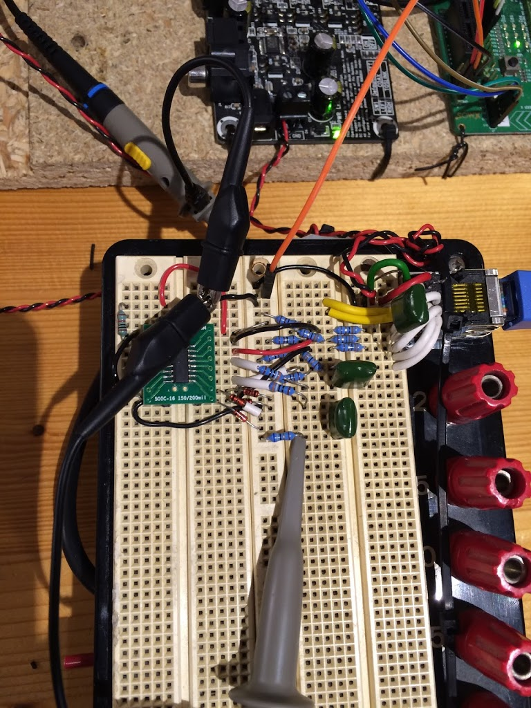
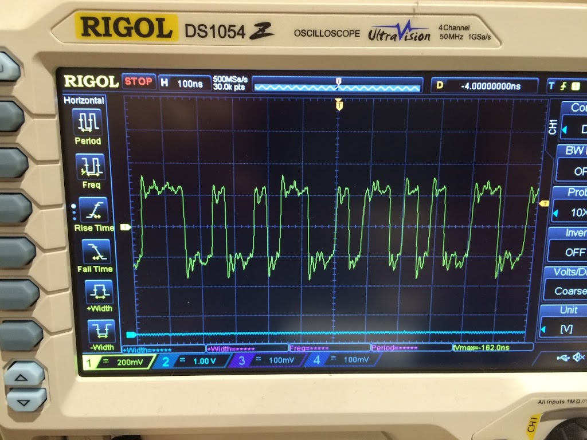

Prototype receiver circuit based on AM26LV32 chip:

The MagJack - a Bel Stewart SI-52008-F has datasheet here: http://www.farnell.com/datasheets/1731561.pdf

The IC cleans up the edges of the incoming signals.

With some level-shifting and AC coupling, the signals are OK to pass into an SPDIF receiver.