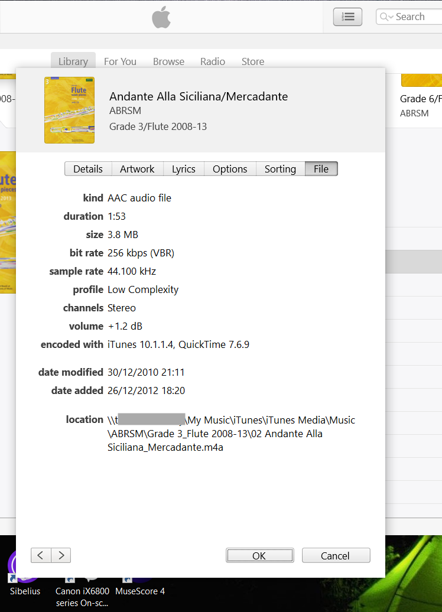
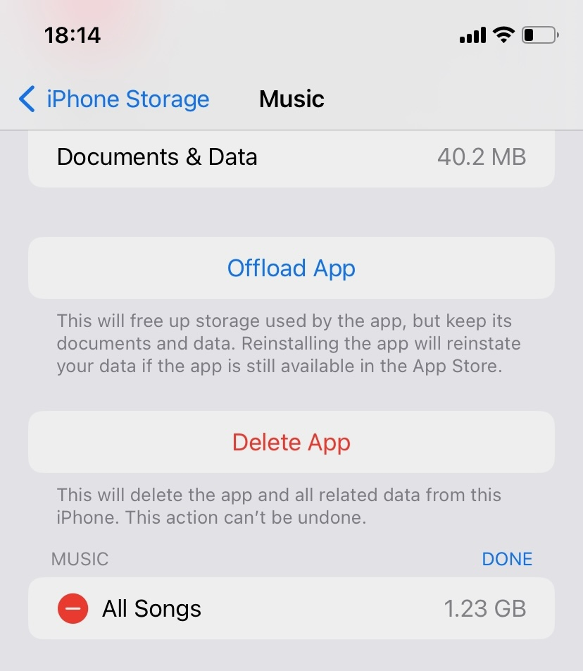

I recently moved our family's personal storage from a ~14 year old QNAP NAS to a new Synology NAS, with roughly 2x the storage.

The migration of data went pretty smoothly, after a couple of false starts. I tried a "restore from USB drive" approach first. After all, both NAS types can back up to `ext4` filesystems, so it should read OK, right?

Unfortunately these copies take a looong time to complete, and the web UI provides no progress measure. I lost confidence in that approach.

Instead, I used `ssh` access to the new NAS. Each share on the old NAS was directly mounted by the new one. `rsync` proved a reliable and repeatable means of moving the data across. It was also possible to exclude junk files from the copying process.

map_vols.sh:
```bash
#!/usr/bin/env bash
for d in fred wilma barney pebbles
do
  mkdir -p /mnt/oldnas/$d
  sudo mount -t cifs -o vers=3.0,user=fred,password=redacted,iocharset=utf8 //192.168.0.4/$d /mnt/oldnas/$d
done
```

moveit.sh:
```bash
#!/usr/bin/env bash

cd /volume1/$1
rsync -va --exclude "Temporary Items" --exclude "Network Trash Folder" --exclude "\$RECYCLE.BIN" /mnt/oldnas/$1 /volume1/
```

`moveit.sh` takes an argument, allowing each share to be moved individually. It can be run repeatedly to move any new data that has arisen since the copy was started. This allowed a "gradual catchup" strategy, with lots of testing of the new NAS, while the old NAS continued as the primary storage.

## Ownership

Files are created by rsync as the current logged-in user with `sudo` permissions, so the files get created as owned by `root`. It was therefore necessary to change file ownership afterwards for each share, e.g.

```bash
cd /volume1/barney
sudo chown -R Barney:users *
```

## Windows
Each of the Windows 10 machines use the NAS as their primary area for "My Documents", "My Pictures" etc. set using the Properties / File Location dialog. This went smoothly for the majority of applications, with notable exceptions: iTunes and Paint Shop Pro 9.

## iTunes (ugh)

After migration, iTunes could see some, but not all of the music library files. This was a pain, because the libraries contained thousands of songs and multiple playlists. Severalof our shares had over 80GB of separately curated music files.

A bit of digging using the "File info" option in iTunes shows that it remembers the full [UNC path](https://en.wikipedia.org/wiki/Path_(computing)#Universal_Naming_Convention) to each media file.



 If iTunes can't find the file, it puts the notorious `!` warning and the "Original music file could not be found" [error](https://discussions.apple.com/thread/252291105?sortBy=best). iTunes will offer to try and find the file for you, but this is an arduous task for more than a few files.

Frankly this is a [can of worms](https://discussions.apple.com/thread/253590789?sortBy=best). iTunes keeps its library in a proprietary, binary-format file `iTunes Library.itl`, in the `Music/iTunes` directory. The similarly named `.xml` file in that folder is there only to give you [false hope](https://youtu.be/14NQIq4SrmY?si=NajP5f0xINSwuNSd&t=62); it's the `.itl` file that iTunes reads and uses.

 The only good solution I found was to abandon any library patch-up work, 
 and do:
 
 * a complete fresh `rsync` of the Music  directory, including the iTunes library files, then
 * _rename the new NAS_ to have the exact same network name as the old one
    * Of course this means you have to also rename the old one, if you want both to be reachable at the same time ..

Once this was done, iTunes can see all its files exactly where it expects them to be.

In the meantime, partly unsuccessful syncs between iTunes and an iPhone meant that had also got confused. Fortunately, it's quite easy to:

* You can delete all songs from the phone. This can be done in a single operation from Settings / iPhone Storage / Music menu

* In the Windows iTunes app, under Edit / Preferences / Devices, there's a [reset sync history](https://discussions.apple.com/thread/2031503?sortBy=best)" option.

I found this was enough to get the library to sync across to the phone again, although it took a couple of tries to get every file across.



## Paint Shop Pro 9

This ancient app was also complaining on startup, until I switched the new NAS name to be the same as the old. Then it worked OK again.
