We have this wonderful sewing machine from the mid eighties, a New Home Memory Craft 6000 -  instruction book is available [here](https://www.janome.com/siteassets/support/manuals/retired/computer/inst-book-mc6000-en-new.pdf). The brand is also known as "Janome". This machine can stitch letters and symbols using microprocessor control, sewing "[emojis](https://en.wikipedia.org/wiki/Emoji)" before that word was widely known.

When it was recently powered on after a few years sat idle, it was completely inert (apart from the work light). A local sewing-machine repair place took a look, said it was blowing fuses repeatedly, indicating a fault on one or other of the PCBs. These were no longer available as spares, and so they considered the machine to be unrepairable.

## A first look inside

The bottom panel gives access to the main PCBs. A service manual is available [here](https://manualsoncd.com/product/janome-6000-memory-craft-sewing-machine-service-parts-manual/), and has useful drawings and a guide to the built-in self-test capabilities. It has no circuit diagrams or hints to fault-finding at component level, which explains why the repair place gave up.

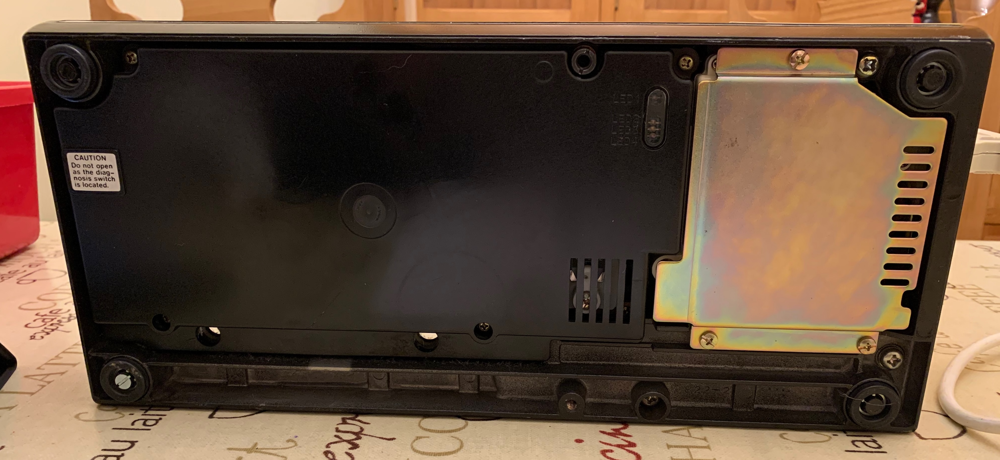

Removing the black plastic and metal panels gives access to the main control PCB, which is known as "Board B".

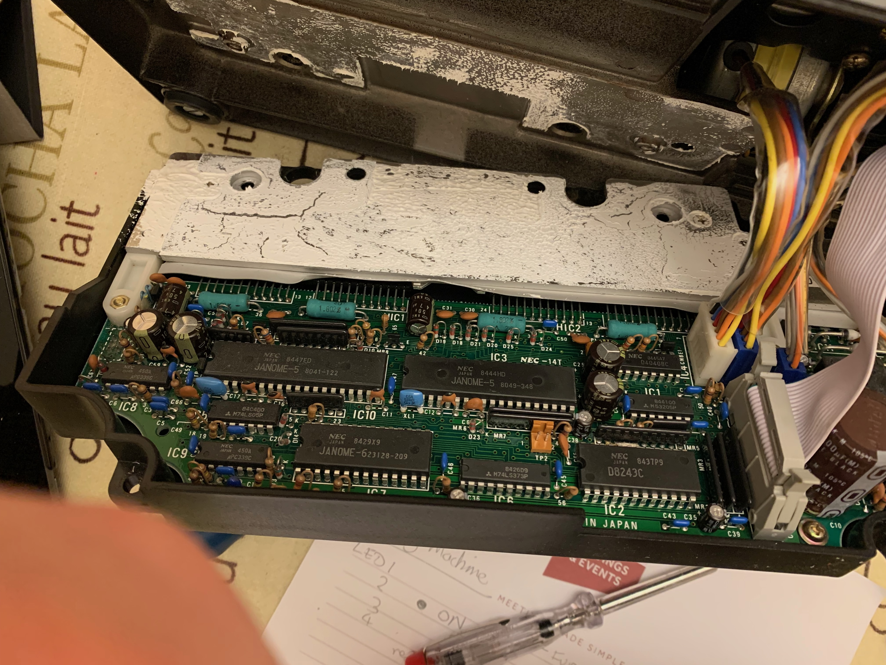

The ribbon connector goes to the front-panel switches and buttons (known as  board A). Multi-way 0.1" pitch connectors feed the stepper motors (it has two; one forward/back and one left/right).

The large heatsink covered in white silicone grease couples to the substantial cast body, providing additional heat dissipation. Two large 24-pin custom devices provide the signals for the stepper motors.

It's an interesting board, comprising classic 40-pin DIL microcontroller and 74LS logic parts. The larger chips will most likely be the CPU, I/O, ROM and RAM. Some are labelled Janome, and may be custom parts; the ROM looks like it is a factory-programmed device, not an EPROM.

I proceeded cautiously here as it was not clear whether some of the board would be carrying mains voltage. It turns out Board B is powered by the transformer (hidden inside the machine body), via a 4-pin connector at the top right, from two separate secondaries.

* Pins 2 and 3 (inner): secondary S1, measured 13v AC RMS (blue wires)
* Pins 1 and 4 (outer): secondary S2, measured 29v AC RMS (purple wires)

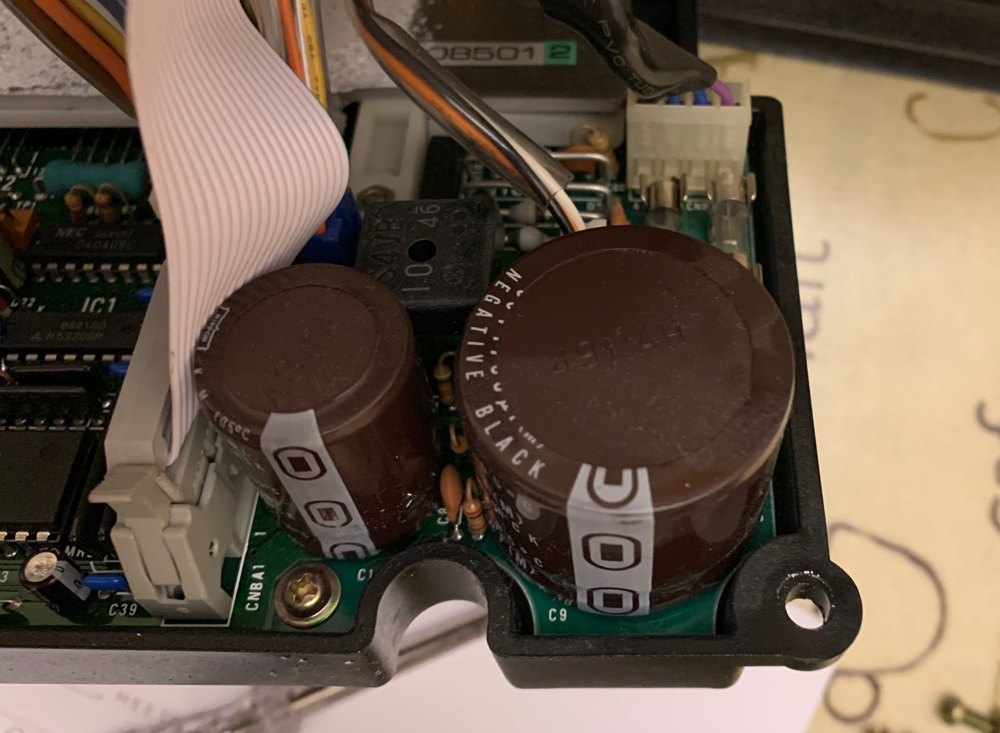

After cleaning off the white silicone grease, we can see the underside of the board. Those hybrid circuits are huge. I couldn't find an exact data-sheet for them, but [this](https://www.alldatasheet.com/datasheet-pdf/pdf/119497/SANKEN/SI-7200E.html) looks similar; this family of devices can handle high supply voltages and high motor currents. Replacing those would be tricky to source due to being long out of production, and expensive - if they were even available at all.

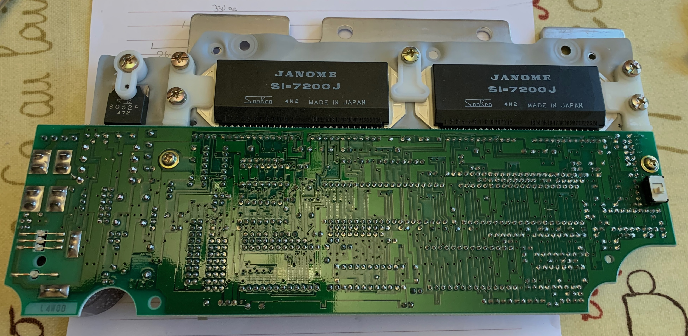

> Spoiler alert: As it turned out, it was a simple fault and the logic + stepper circuits were fine.

## Fuses and rectification

The power passes through two onboard antisurge fuses:
* F1, 1.6A for the lower voltage side. This was intact.
* F2, 2.5A for the higher voltage side. This was blown.

### Lower voltage DC supply for CPU & logic

This passes through the packaged full-wave rectifier (an S4VB) to cap C10, 3300µF, 25v. This side is working; it then passes through a regulator IC11 3052P which drops it down to 5v for the logic.

Probing around the logic chips found some periodic signals which indicated the board was not completely dead.

### Higher voltage DC supply for steppers

Four discrete diodes acts as a full-wave bridge rectifier. This feeds the large smoothing capacitor (C9, 4700µF, 50v).

There is also a "mystery" MI-10 component which looks like it might be two diodes in a 4-pin package. Maybe this is protection for back-EMF from the stepper motors.

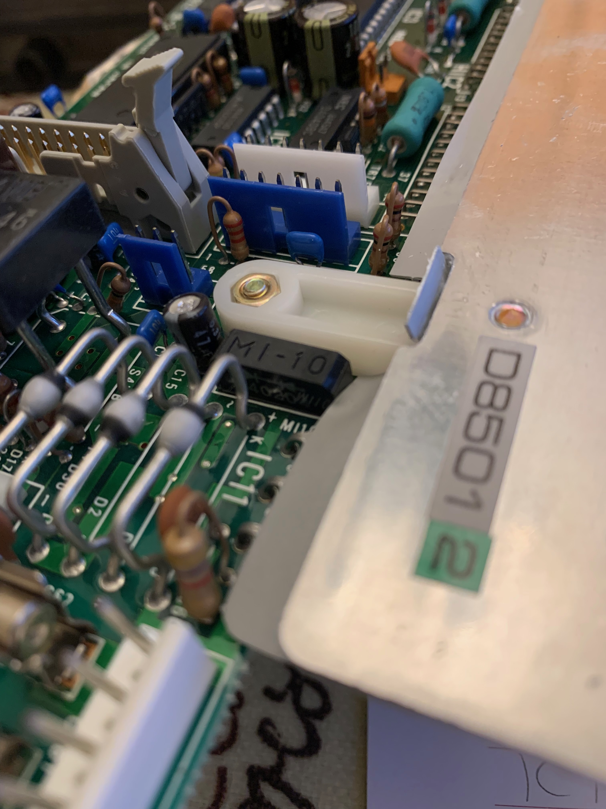
_mystery component_

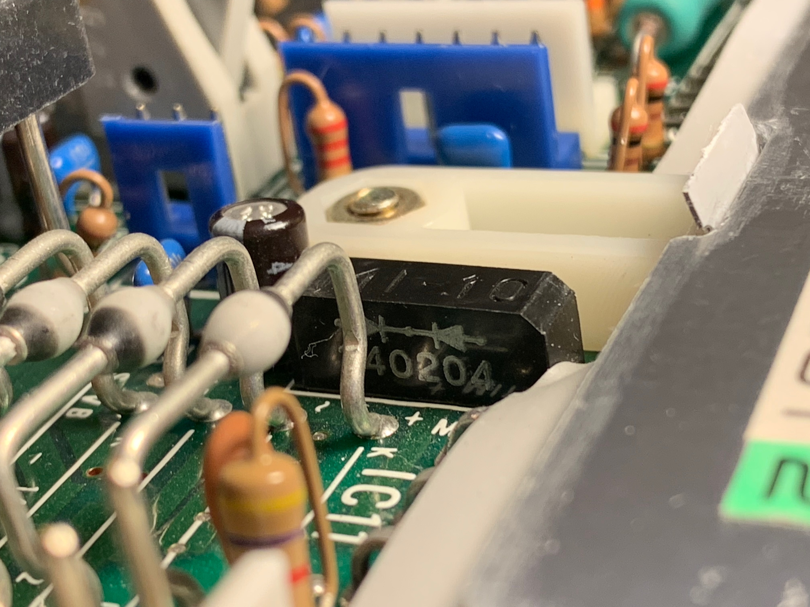
_mystery component, side view_

Removing C9 and testing it with a meter showed it had failed short-circuit, not too surprising as it's nearly 40 years old! It's a Nippon Chemi-Con device, with two "prongs" per terminal, one of them turned 90 degrees. I couldn't find an exact physical match, but [CPC Farnell](https://cpc.farnell.com/) had some stock that was similar.

I also got replacements for C9 and C10 as both will have aged, and could fail soon.

Modern capacitors tend to be physically smaller for the same value and rating, so I ordered two of each value: one with the same voltage rating, and one with higher voltage rating. If the higher-rated ones physically fit, then they should be long-lasting.

|Part No|Description|
|--|--|
|[FF03099](https://cpc.farnell.com/multicomp/mc000876/fuse-5x20mm-glass-time-delay-2/dp/FF03099)|Fuse, 5mm x 20mm, Glass, Time Delay, 2.5A|
|[CA08613](https://cpc.farnell.com/multicomp-pro/mcklz100m472p40y/cap-4700-f-100v-alu-elec-snap/dp/CA08613)|MULTICOMP PRO  MCKLZ100M472P40Y  Electrolytic Capacitor, 4700 µF, 100 V, ± 20%, Snap-In, 2000 hours @ 105°C|
|[CA04834](https://cpc.farnell.com/multicomp/lpr50v478m30x25/capacitor-4700uf-50v/dp/CA04834)|MULTICOMP PRO  LPR50V478M30X25  Electrolytic Capacitor, 4700 µF, 50 V, ± 20%, Quick Connect, Snap-In, 2000 hours @ 85°C|
|[CA08606](https://cpc.farnell.com/multicomp-pro/mchpr63v338m25x26/cap-3300-f-63v-alu-elec-snap-in/dp/CA08606)|MULTICOMP PRO  MCHPR63V338M25X26  Electrolytic Capacitor, Snap-in, 3300 µF, 63 V, ± 20%, Snap-In, 2000 hours @ 105°C|
|[CA08585](https://cpc.farnell.com/multicomp-pro/mchpr35v338m22x26/cap-3300-f-35v-alu-elec-snap-in/dp/CA08585)|MULTICOMP PRO  MCHPR35V338M22X26  Electrolytic Capacitor, Snap-in, 3300 µF, 35 V, ± 20%, Snap-In, 2000 hours @ 105°C|

I chose the larger, higher-voltage options as being the better physical fit. Despite C9 replacement being taller, there is plenty of space inside the machine chassis to accommodate the new part.

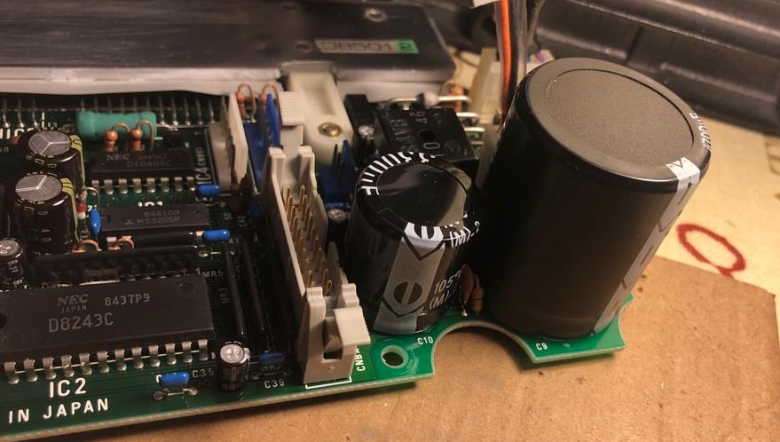

It needed some adjustment to get the legs to fit the board pads, but this wasn't difficult.

Next, I reconnected board B while it was still outside the machine, as shown below. The power supply measured correct DC voltages and the fuse no longer blew.

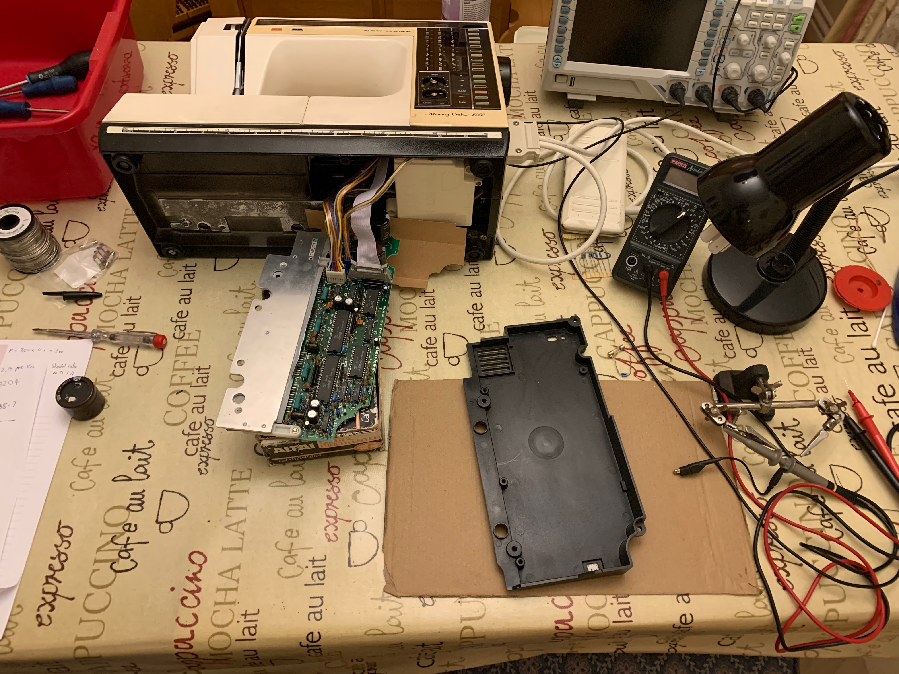

## Speed control board

I briefly examined this board, but it did not appear to be involved in the fault. Its fuse was intact.

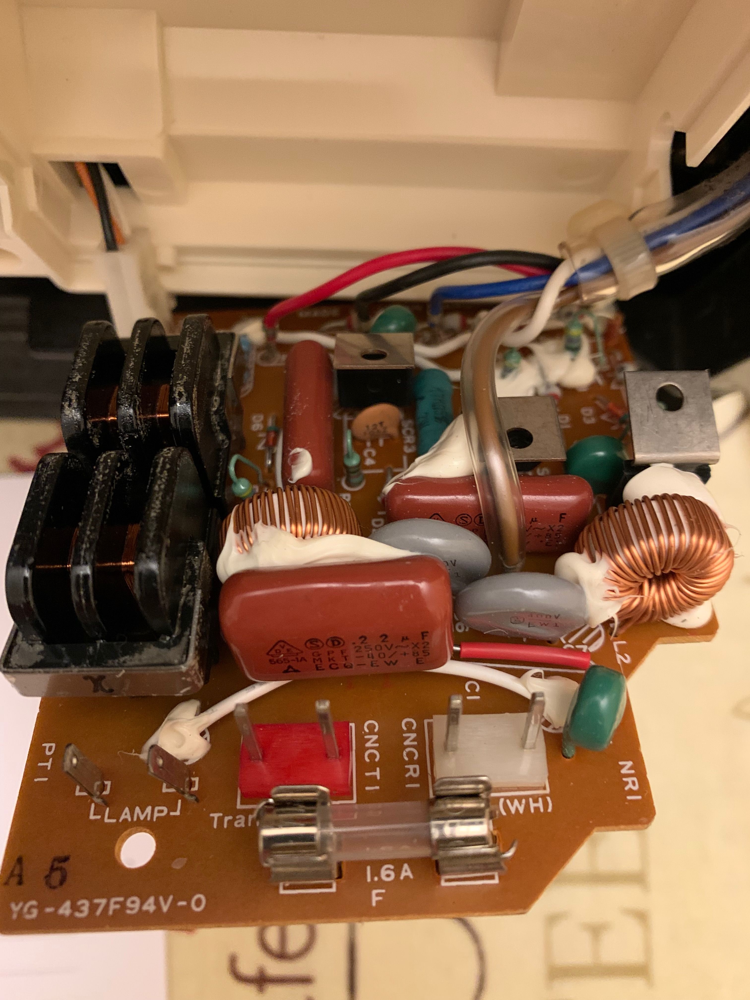

## Re-assembly

I used a small diamond file to "flat" the heatsink, before re-coating with modern CPU [heatsink compound](https://www.amazon.co.uk/dp/B0B7JPDFDZ).

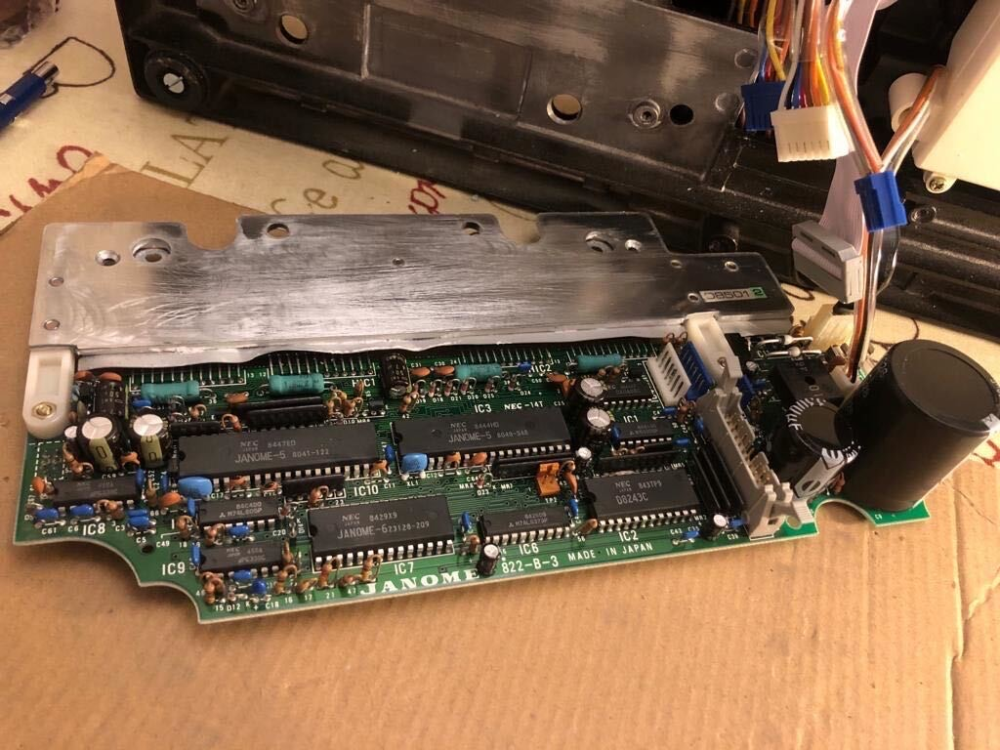

I then reassembled the machine, and went through the self-test routines which appeared to pass. The machine now stitches patterns again!

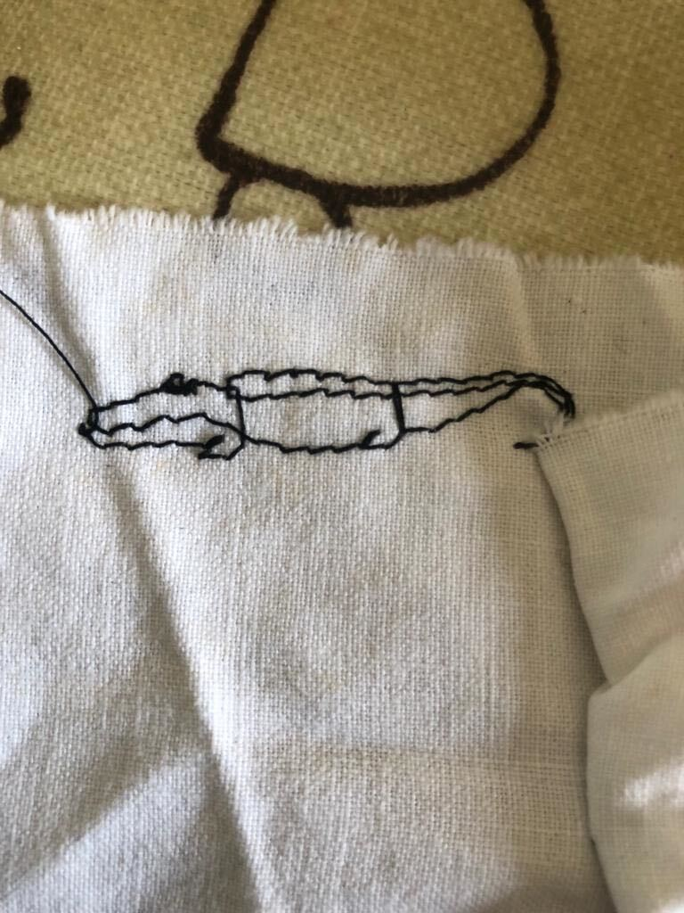

I also replaced the work light with a [modern LED equivalent](https://www.amazon.co.uk/dp/B0B5N9BCXW) that is much brighter and whiter.

## Next steps

It could still do with a mechanical service, so it will go back for that shortly.
