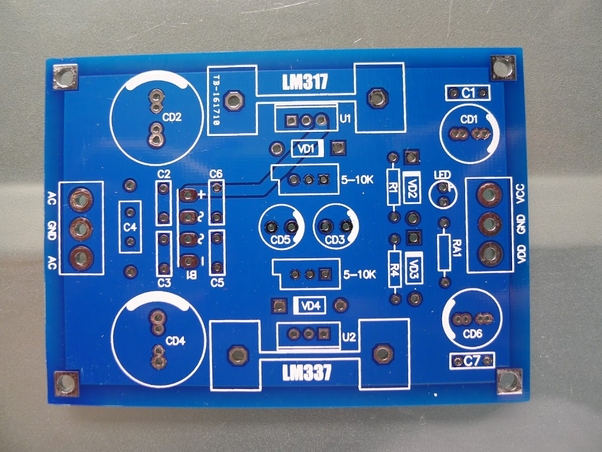
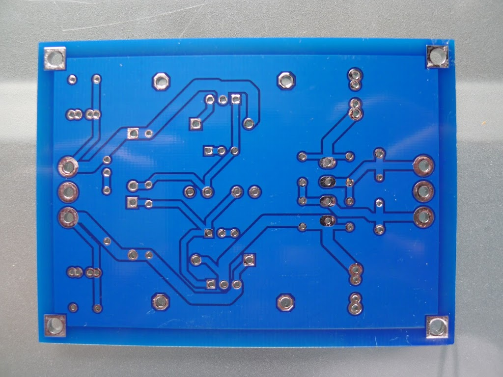
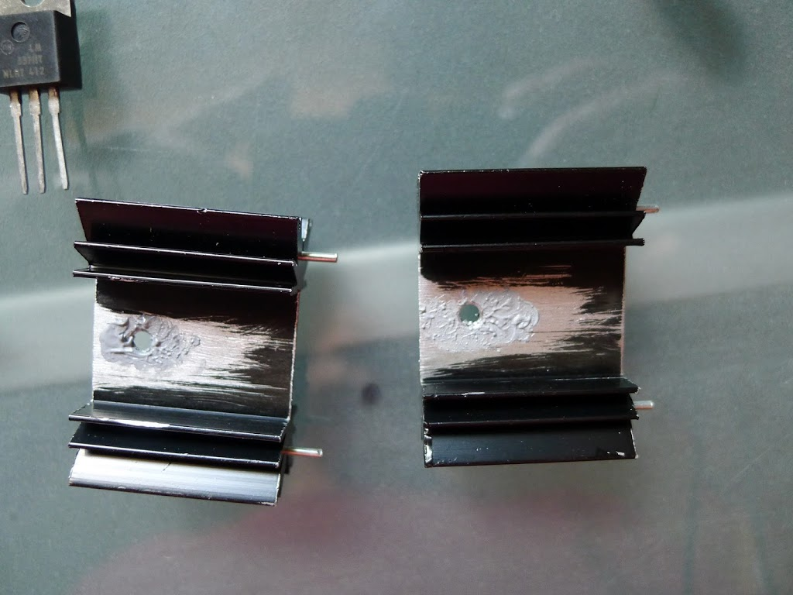
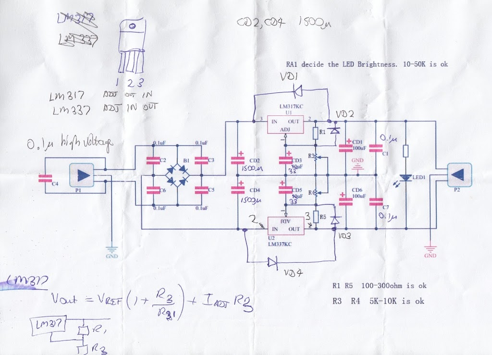
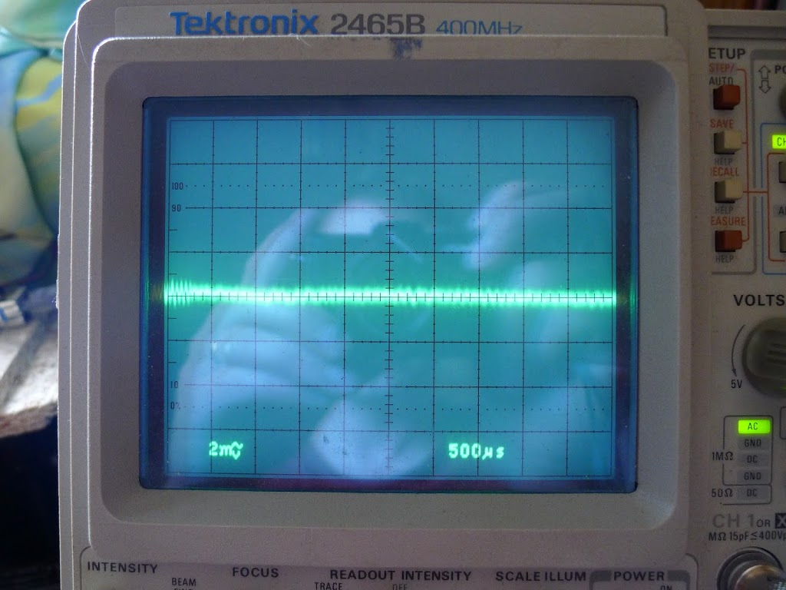
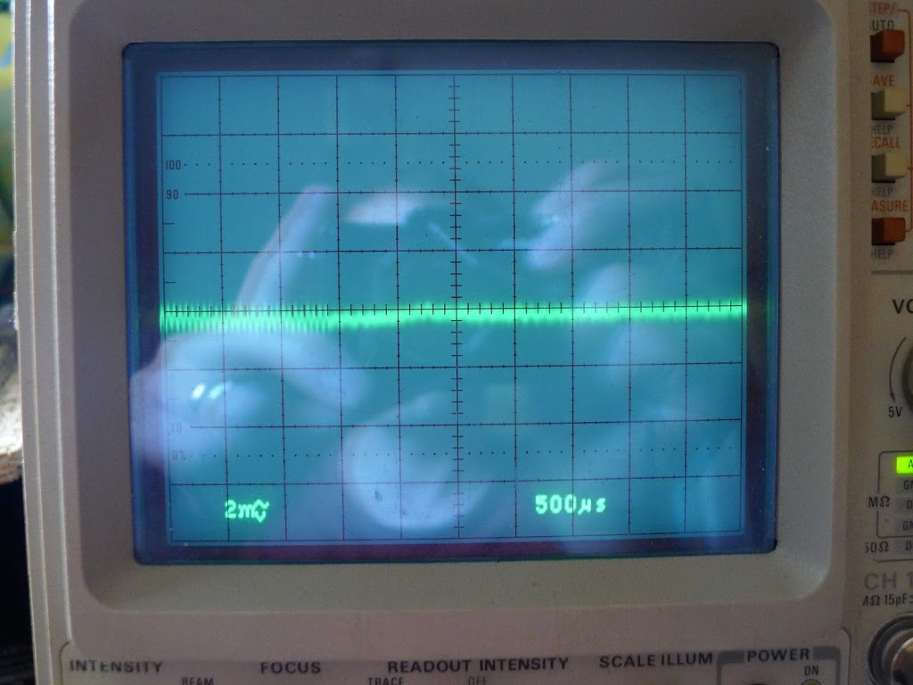
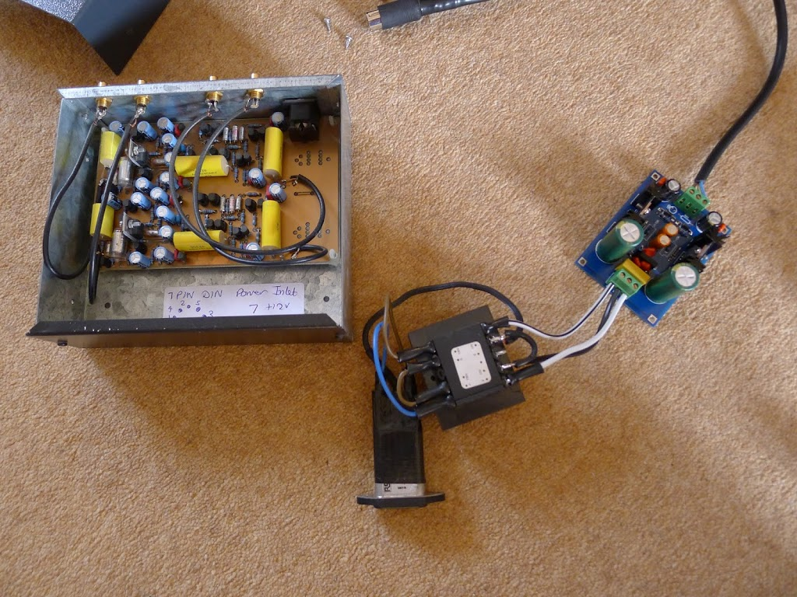

Ages ago, I built a John Linsley-Hood design of phono preamp, first published in ETI magazine in 1992. This was considerably better than the phono stage in the integrated amp I was using at the time (a Creek CAS4040).

For a couple of decades I ran this from my bench power supply, so it was definitely time for its own PSU.  Rather than etching my own circuit board, nowadays kits are available via eBay that save a lot of that messy work.  I wanted something based on the LM317 / LM337 regulators, as they are known to have superior noise performance and regulation compared to the standard 7812 / 7912 family.

I started with an eBay kit.  Unpacking, you have a bag of bits and a very nice looking double-sided, through-hole-plated, silk-screen-printed PCB - way better than you can make yourself.  And the total price of the kit is less than you'd pay from a regular supplier for the parts.  The large electrolytic caps are Sanyo branded, and look genuine to me.

Here's a view of the PCB sides:

The negative regulator is branded "On" which is On Semiconductor, formerly Motorola.

I filed down the burrs on the heatsink holes, removed the anodization/paint with a small file, and applied some PC heatsink paste.  Probably overkill, considering that the preamp will draw less than 100mA, but better than overheating.

Here's the regulators mounted on the heatsinks, ready to insert in the board.

The circuit diagram supplied with the kit didn't quite match the PCB & kit of parts.  Here's a marked-up version of the diagram:

The bypass capacitors around the full-wave rectifier diodes were interesting - I hadn't seen those before.  I found [this site](http://electronics.stackexchange.com/questions/14250/what-are-the-advantages-of-full-wave-bridge-rectifier-with-capacitors-parallel-t) and [this article](http://www.hagtech.com/pdf/snubber.pdf) which explains what they're for.

Even with the caps in place, some ringing is evident when looking at the transformer secondary taps. While I'm somewhat skeptical that this would ever be audible, let's see if we can do better, based on that second article.

Firstly, let's add 330R dummy load resistors, so we can test the circuit behaviour without endangering the regulators.

The ringing is definitely there on the transformer secondary output:

Here's a closeup of the rising and falling edge ringing:

Now let's add 180R in series with each of the 100n snubber caps.  It's a little bit awkward to fit this into the existing PCB, but it's possible. Here's the improved damping result.

Here's the improved R-C snubbers in place.

Looking at the 12v outputs, they're pretty clean, with noise below 1mV on each rail.

Ready to connect to the preamp.  I used a trailing 7-pin DIN socket for the power (using pins 6 & 7 for -/+12v so they can't be mistakenly connected to audio inputs).

12v-12v secondary transformer and surge-protected IEC input.

The finished power supply, mounted inside an [ABS box from CPC](http://cpc.farnell.com/hammond/1594esgy/heavy-duty-gpabs-enclosure-grey/dp/EN84310?ost=1594ESGY).

I found that, when the preamp is connected to other devices such as USB sound-cards, hum levels were reduced when the power supply 0v output was **not** connected to mains earth. Perhaps the PC was already earthing via the sound-card and it was just introducing a ground loop.