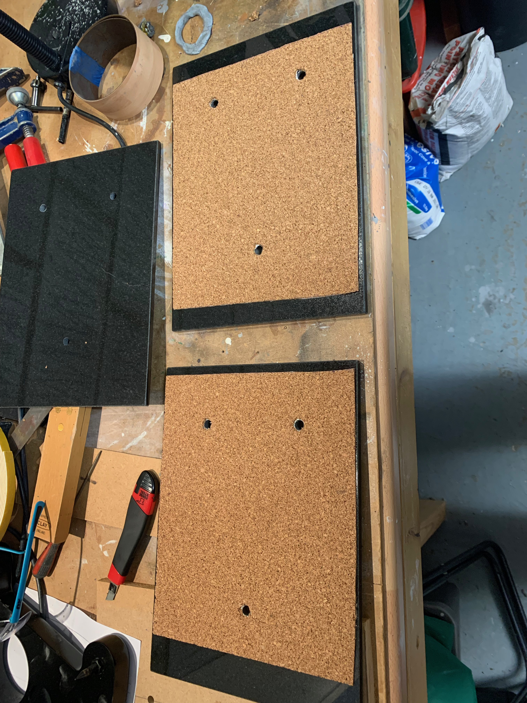

I still like my [PMC GB1i](https://pmc-speakers.com/products/archive/archive/gb1i) speakers a lot. They are slim and sound great, but have one practical disadvantage in our house: our cat is heavy enough to knock them over. The relatively narrow spiked bases don't offer much resistance against toppling.

*Sully, 6+ kilos .. no contest*

How are the steel spikes meant to "isolate" speaker cabinets from the floor, i.e. what's the physics behind this hi-fi orthodoxy? Steel conducts sound quite well. I suspect the actual beneficial effect (if anything) is to anchor the cabinets firmly to the floor, allowing the drivers to push air while resisting [Newton's third law](https://en.wikipedia.org/wiki/Newton%27s_laws_of_motion#Newton's_third_law) moving the cabinets in the opposite direction.

We've got concrete floors anyway (underneath the carpet and underlay). Getting four spikes to align perfectly without some wobble has always proven difficult. The GB1i's are not very heavy; the carpet offers some springiness which doesn't help.

Mass on the bottom of the speaker seems like it will achieve the same benefit. Maybe we can have anchoring and isolation - more on that later.

I considered a few options:

* Metal "tripod" type feet, that could be fabricated for me out of square section tubular mild steel. These could be much wider, and easier to level and true up, while retaining the existing spikes. Also easy to trip up and stub a toe on!
* Wider solid oak bases, which could be made in layers, with the middle layer routed hollow (chambered) and filled with something heavy, such as lead shot.
* Stone such as granite (my chosen option).

## Where to get granite?

A quick foray to kitchen worktop suppliers and "monumental masons" (headstone makers) looked like it was going to be expensive (£200+), even for offcut pieces of any colour. I then found granite [chopping boards](https://www.dunelm.com/product/black-granite-work-top-surface-protector-1000009315) and [placemats](https://www.dunelm.com/product/black-granite-pair-of-placemats-1000033683);  mass-produced articles are usually cheaper than bespoke items.

Machining and drilling granite for the three large (M8) mounting screws would be the main challenge. The placemats were the perfect width and length for this project, but one is not really thick or heavy enough.

Height of the speaker is important; the ideal is to have the high frequency drive units (tweeters) at ear level when you're seated and listening, so I wanted the result to be close to the thickness of the standard MDF bases & spikes.

## Isolation and anchoring

Acoustic isolation in rooms is usually done through [dissimilar materials](https://en.wikipedia.org/wiki/Recording_studio#Isolation_booth), e.g. a sandwich of heavy plasterboard and light foam. This causes a deliberate acoustic impedance mismatch, reducing the onward transmission of sound.

Frankly I would expect carpet to do a pretty good job of not transmitting vibrations from the cabinets down to the floor anyway. For this, and more importantly get the correct tweeter height, granite and thin cork sheet seems like a good combination to try. I settled on the idea of a sandwich construction, with three sheets of placemat granite separated by a 1mm layer of cork, which is [readily available on eBay](https://www.ebay.co.uk/sch/i.html?&_nkw=cork+sheet).

## Drilling

Drilling and machining granite needs diamond-tipped tools. These are also available inexpensively from eBay (or perhaps better quality from suppliers in the UK such as ToolStation). I went for a low-cost eBay 8mm drill bit and countersink.

> **Care is needed to avoid breathing [granite dust](https://www.wehausa.com/granite-dust-s/2686.htm#)**.

The simplest way to greatly reduce this is to drill wet. Water is also helpful to cool the cutting surfaces, preventing overheating and premature wear.

## Preparation

Marking out the granite for drilling needs care. Decorator's masking tape makes it much easier to lay out the holes.

I took measurements from the existing bases, made a template, and then double-checked everything by aligning the base over the marks.

I decided to stack and drill three mats together, using tape and clamps to hold them in alignment. To ensure they fitted together tightly for drilling, I removed the felt feet from all but the bottom-most mat.

I only had a bench-top pillar stand for a regular corded drill (Black & Decker, approx. 35 years old). A proper pillar drill would have made the job easier by reducing movement and the risk of chatter during drilling.

## Moat for water cooling

A ring of blu-tak served as a "moat" that I could fill up with cold water. Having the workpiece firmly clamped down helps to prevent the bit wandering and causing mistakes.

The water quickly turns to "slurry" as cutting proceeds. I regularly mopped it out and replaced with fresh water.

I made slow but steady progress through each layer, backing out the bit to allow water to flow down into the hole for adequate cooling. Once through the first layer, the water seeps away a bit between layers, needing constant topping-up.

Soon I had the first hole done through three layers. The cut looked quite clean and straight, with very little breakthrough on the back.

The second and third holes were done in the same way.

 I checked alignment was good by placing the M8 screws through the existing bases and down through the freshly cut holes, from both top and bottom.
 

*Top surface alignment*

*Bottom surface alignment*

 So far, so good!

 ## Countersinking

 The M8 screws supplied with the GB1is have countersunk heads. The taper seems to be standard. I countersunk the bases. This is nice because the screws will fit flush into the mats. I needed a different approach to cooling containment, as the countersink bit threw a lot more spray. A bit of old veneer edging was ideal for this.

After thoroughly washing and drying the work, the cork sheet was cut to size and fitted to the bottom and middle layers.

The speaker undersides have captive threaded M8 "Tee" nuts. 
First test fitting to the speaker went well; the holes aligned perfectly. I had wondered if I'd need to get get longer M8 screws, but the existing ones fitted OK with enough "turns" to grip well.

The finished bases in situ:

I repeated the process for the left side. A nice benefit is that adjusting speaker position (forward/back) and toe-in is much easier, when you're not wrestling the spikes through the carpet.

The improved stability is shown in this video.



## Listening tests

I'd say the system sounds _"defnitely no worse, maybe a tiny bit better"_ after the change. I'd put this down mostly to being able to play with the toe-in more easily for my chosen sweet-spot listening seat.
