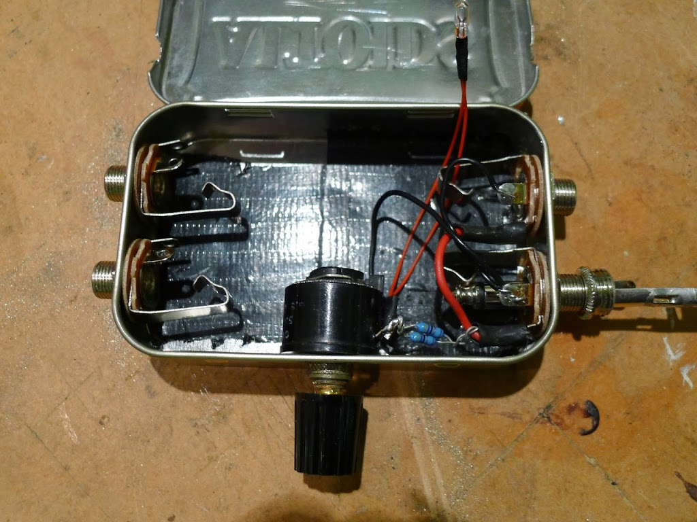
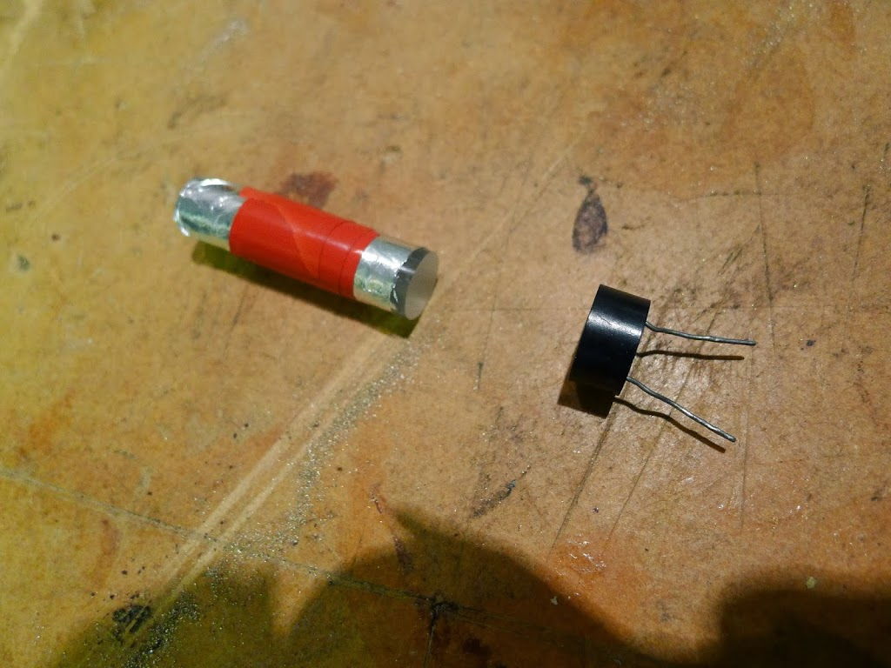
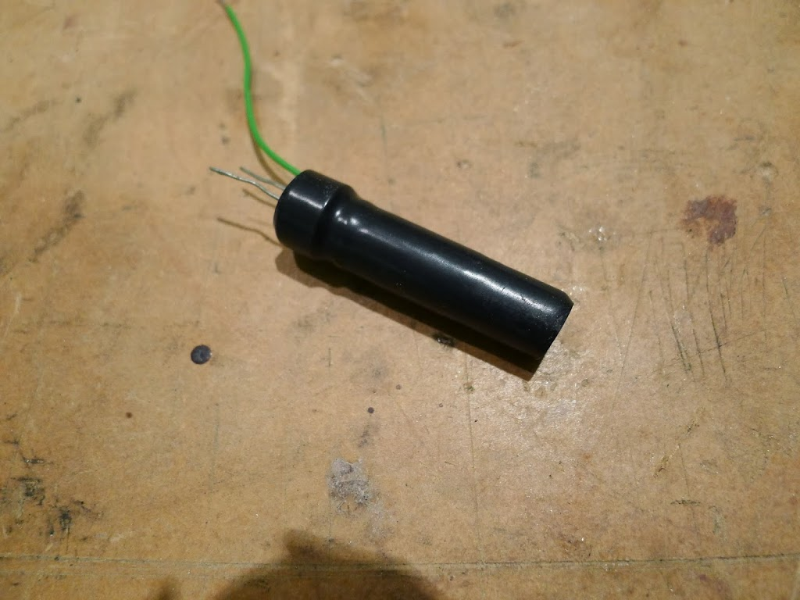
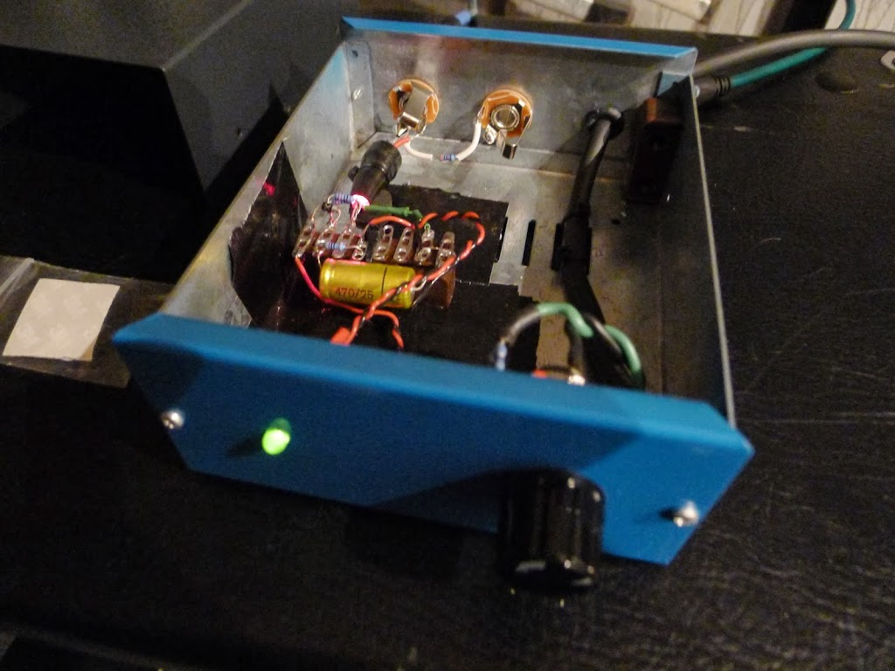
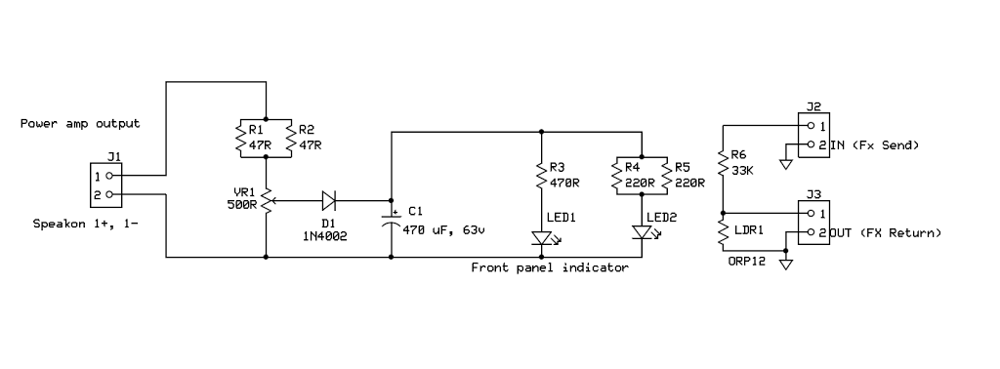

An extremely simple yet capable compressor circuit is published by Elliott Sound Products,[here](https://sound-au.com/project45.htm) (*link updated 31 Dec 2023*).

## Compressor Mk I

I built the circuit exactly as-is (in an Altoids tin).

Care was taken to optically couple the bulb to the photocell (LDR), using a perspex rod, wrapped in smooth tin-foil.  The perspex came from eBay:
[http://stores.ebay.co.uk/thewholesaleposco2009](http://stores.ebay.co.uk/thewholesaleposco2009)

as did the miniature "Grain of Wheat" bulbs:  [http://stores.ebay.co.uk/GnA-MODELPARTS?\_trksid=p2047675.l2563](http://stores.ebay.co.uk/GnA-MODELPARTS?_trksid=p2047675.l2563)

This was put together, and sealed in heatshrink tubing, to make it fairly lightproof from external light sources.  The rest of the components came from [http://cpc.farnell.com](http://cpc.farnell.com/) (free postage) or from my junk box.

Here's the final assembly.  The green wire provides grounding (shielding) for the tin-foil, as per the original article description.

Here's the finished article.  The Altoids tin was really too small, so I had to cut notches in the lid, which rather spoiled the look.

The duck tape on the bottom of the box provides insulation.  The whole tin is effectively coupled to the amp "earth" via the jack socket outer rings.

I soon discovered the following:

*   Using jack-sockets to carry high-current, low-impedance amp output signals is a very dumb idea.  I knew this before, I just kind-of forgot it in the urge to get everything to fit in an Altoids tin.  Even with the amp output muted (but powered), I got a fat blue spark when unplugging the box.
*   The "grain of wheat" bulbs don't really get into their proper operating range of brightness when you have an efficient speaker cabinet (like a [www.barefacedbass.com](http://www.barefacedbass.com/) one) - even when the variable resistor is turned right up.

My amp has an FX send / return loop, so I was using that for the input side (on the left).  The two speaker sockets (on the right) were there in case a "pass thru" was needed, although again my amp has two speaker-outs, so no need to use that in practice.

I was a bit concerned about the way the tin was earthing together the FX send/return loop with the "-" side of the amp output.  It worked fine for the two amps I tried, but what would happen if it was connected to an amp in bridge-mode where the "+" and "-" sides were both driven?  Clearly not ideal.

## Compressor Mk II

 Mk II was going to be built in a proper case, with a Speakon plug on a trailing lead (so it simply cannot be plugged in wrongly), and would use a high-efficiency LED with suitable dropper resistors instead of the bulb (so as to be more effective at low amp output levels).

It would also have electrical isolation between the amp out / speaker side, and the delicate FX send/return loop (which will be used for a shielding / ground connection for the case).

Here it is:

The Speakon cable enters through a grommet, is double tie-wrapped to the floor of the case, so even your clumsy drummer friend shouldn't damage it.

The variable resistor is a 5 watt, 500 ohm type which I found on eBay:
[http://stores.ebay.co.uk/Interesting-Electronics?\_trksid=p2047675.l2563](http://stores.ebay.co.uk/Interesting-Electronics?_trksid=p2047675.l2563)

You'll notice a pair of 47 ohm fixed resistors, in parallel, on the green input wire next to the variable resistor.  In parallel that makes around 24 ohms.  The purpose of that, is to prevent the last little bit of the variable resistor's track dissipating a lot of power.  In fact it's hardly necessary as the LEDs use less power than the bulbs.  I used two small resistors in parallel because they have a low power rating (I think 1/4 watt) and didn't want them to get too hot.

Because LEDs can "flash" much faster than a bulb can, and only respond to current in one direction, we need a "rectifier and smoother" circuit.  This is what the small diode and big  capacitor does.

The capacitor is 470uF, 25v (from the junk box).  Voltage rating is important, as your amp can produce quite high peak voltages.  Make sure you use at least a 25v rated one, higher if you can - preferably 63v.

The output of the capacitor feeds two separate LED circuits.  The first one has 2x 220 ohm in parallel (effectively 110 ohm) feeding the high-efficiency LED that is inside the shrink wrap.  Because the LED light output is very directional, I did not use the perspex rod - I just put the LED right up against the front face of the LDR.

The second circuit goes through 470 ohms to a small front-panel LED.  The idea being that you can see what the compressor is doing from the outside.

The final part of the circuit is the same as the Elliott original.  A 33k resistor couples the input side (amp:  FX SEND) to the output side (amp:  FX RETURN), forming a potential divider with the LDR.

With the lid off in the dark, you can see both LEDs are working together.

The case was sprayed a non-Ashdown blue, and a nice quality collet knob from CPC/Farnell added.

The final circuit seems to work well - the component values will need some tweaking to suit your amp / cabinet combination.  If you want a circuit that is less sensitive to amp/cab variations then you might want to look at the other Elliott pages.

Circuit diagram:

Free download in [PDF](img/Bass%20Guitar%20Passive%20Compressor.pdf)
and [ExpressPCB](img/Bass%20Guitar%20Passive%20Compressor.sch) .sch format (R-click / Save As) .. software available [here](http://www.expresspcb.com/expresspcbhtm/Free_schematic_software.htm)