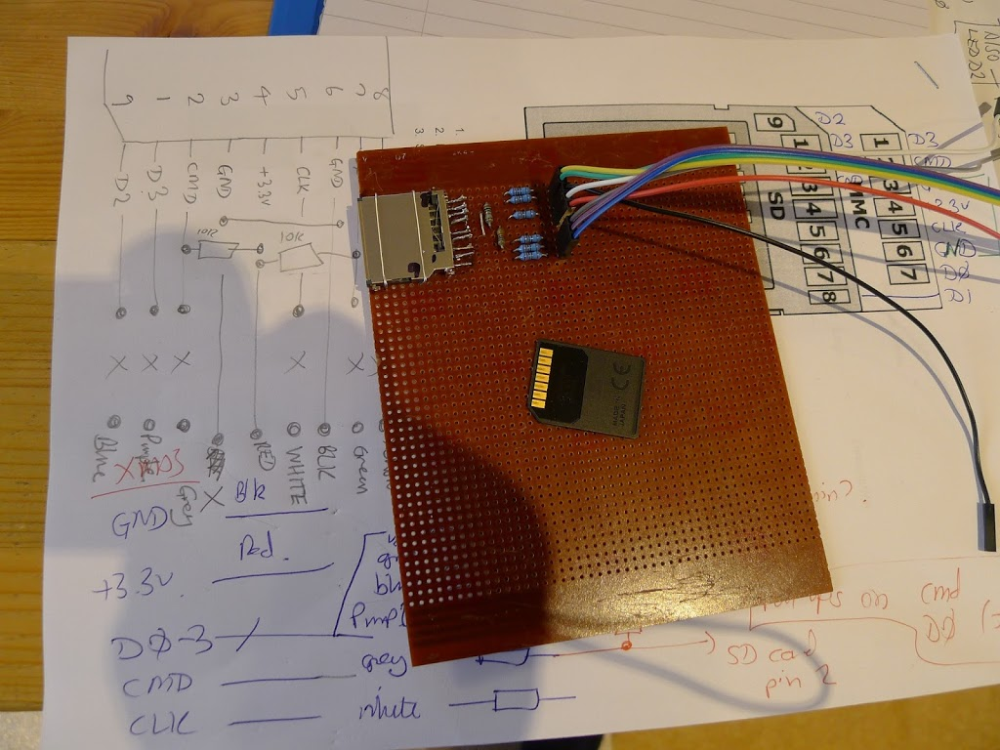
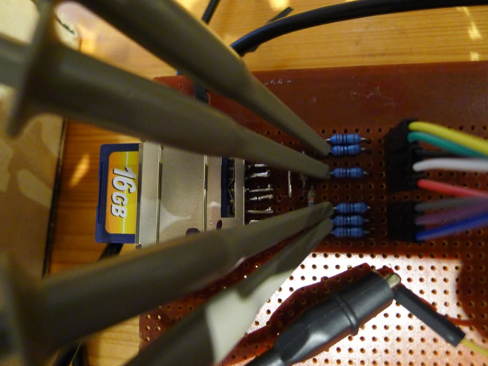

Being able to read/write information from an SD card is probably the easiest way to get large amounts of non-volatile storage into an embedded project.
I'm using XMOS StartKit, with the code [from here](https://github.com/xcore/sc_sdcard/blob/master/README.rst)

The card reader is a part from Wurth Elektronik, Farnell / CPC part number CN18143 available [here](http://cpc.farnell.com/wurth-elektronik/693063010911/memory-socket-sd-card-push-pull/dp/CN18143?ost=CN18143).




The data and clock lines have 120 ohm series resistors, as this can help to absorb transmission-line reflections on the connecting wires (even though they are fairly short).

In addition, pins 2 and 7 have 10K ohm pull up resistors.

Pins on an SD card are numbered from 9 (the chamfered end), then 1 to 8.  This is because very early cards, like the one shown above, have no pin 9.

SD cards run from 3.3v, so this can be provided directly from the StartKit board.

The XMOS code supports both 1-bit (SPI mode) and 4-bit data access mode.  Initially the code is set to use 1-bit SPI mode.

As well as GND and 3.3V, SPI mode only requires pins:

|Pin|Purpose|
|--|--|
|1|CS|
|2|MOSI|
|5|SCLK|
|7|MISO|

These are connected up and monitored on the scope.



The signal quality looks OK.

The very old 16Mbyte card that I started with, would not read/write (it gave reason code=3). A newer 16GB card read/wrote OK, as follows:

```
15026112 KB total drive space.
15748096 KB available.

Deleting file Data.bin if existing...done.

Creating a new file Data.bin...done.

Writing data to the file...20480 bytes written. Write rate: 215KBytes/Sec

Closing the file...done.

Opening an existing file: Data.bin...done.

Reading file content...20480 bytes read. Read rate: 275KBytes/Sec

Closing the file...done.

Open root directory.

Directory listing...
   <dir>  DCIM
   <dir>  MISC
   <dir>  PRIVATE
    4096  ~1.TRA
   20480  DATA.BIN
   <dir>  TRASHE~1
   <dir>  SYSTEM~1

Test completed.
```

The file `SDCardHostSPI.xc` contains the XMOS port mappings for these lines, as follows.  I've used these unchanged in this test.


```c
static SDHostInterface SDif[] = // LIST HERE THE PORTS USED FOR THE INTERFACES
// cs, sclk, Mosi, miso
{
   XS1_CLKBLK_1, XS1_CLKBLK_2, XS1_PORT_1O, XS1_PORT_1M, XS1_PORT_1N, XS1_PORT_1P, 0, 0
}; // resources used for interface #0
```

The ports map onto StartKit pins as follows:

```
SD card 1 CS = XMOS J7 pin 21 = Port 1O

SD card 2 MOSI = XMOS J7 pin 17 = Port 1N

SD card 5 SCLK = XMOS J7 pin 15 = Port 1M

SD card 7 MISO = XMOS J7 pin 23 = Port 1P
```