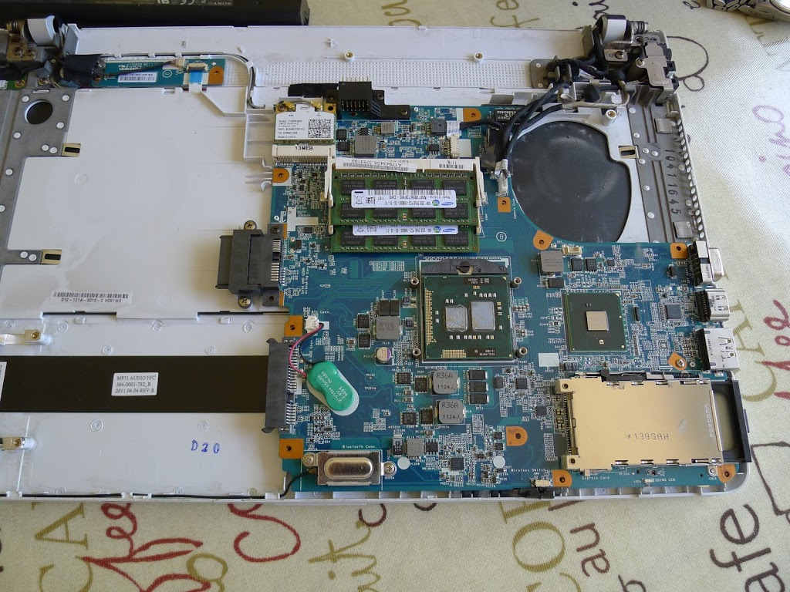
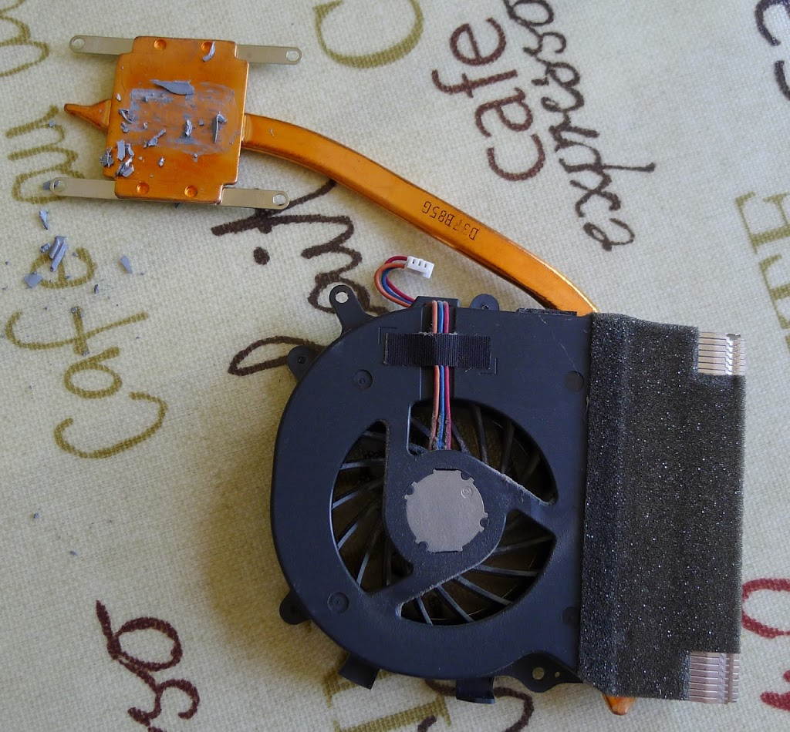
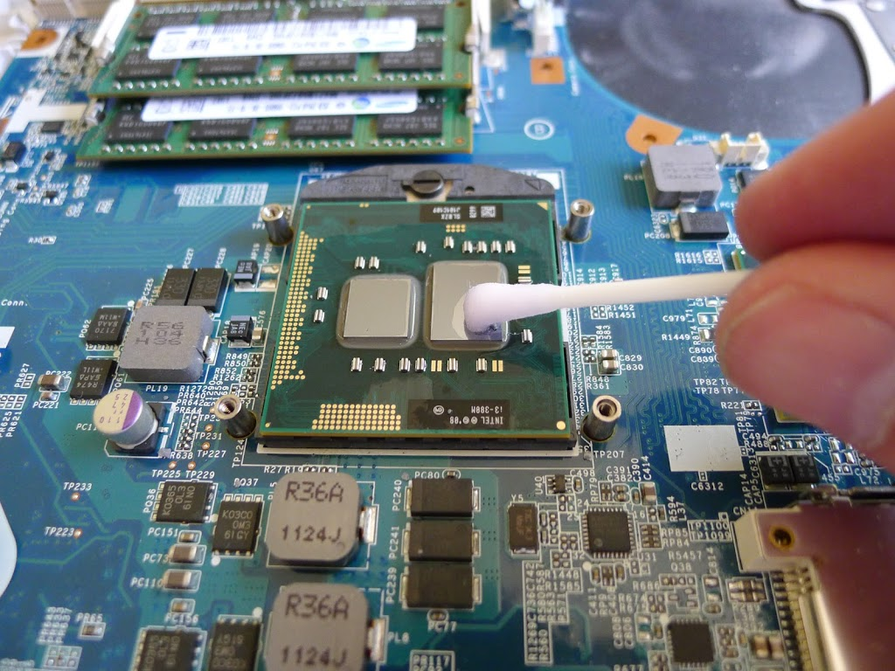
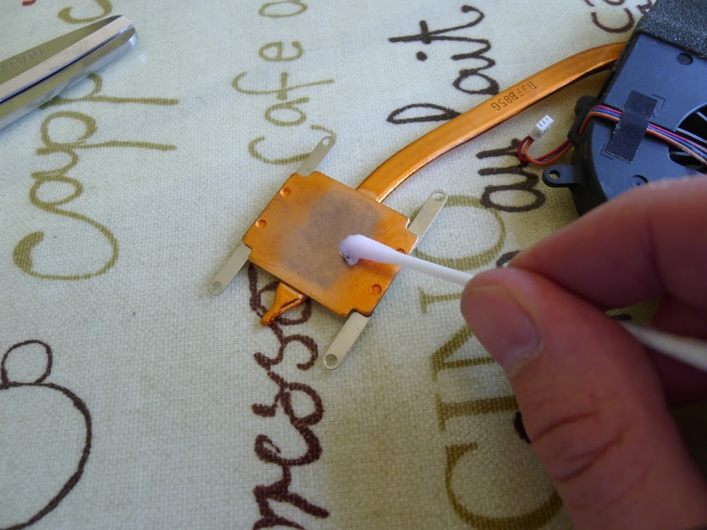
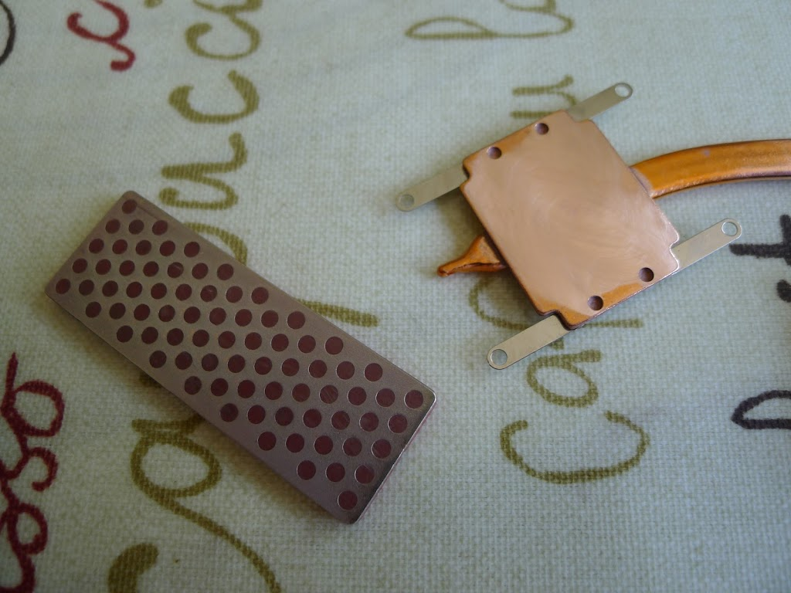

This time, it's a Sony Vaio VPCEB4L1EWI, with i3-380M CPU.  About two years old.  Running Prime95 stress test, the cores were reaching 85 deg C and the fan was rather noisy.

1.  Strip off the back plate, undoing all the visible screws, taking careful note of where they all go back - there are several different sizes and types.  The back plate then snaps off - be careful with the small white lugs on the upper side here. One came off despite me taking care. 

Always wear an anti-static wrist strap, connected to a metal part of the laptop (e.g. the USB connector) when working.

2.  Here is the heatsink / heat pipe / fan assembly removed.  The grey heatsink paste had set quite hard.

3.  Clean up the CPU top surface carefully with meths, a cloth, and cotton buds. 

4.  Clean all the old paste off the heatsink.

5.  To do a really good job, "flat" the heatsink down with a diamond file, cleaning the copper dust off regularly.  I kept applying a few drops of meths as a non-greasy lubricant while working.

After a few minutes you should be able to get a near mirror-finish on the heatsink.  Don't over do it - copper is a very soft material.

7.  Apply a new heatsink paste (I used Arctic MX-4), and re-assemble the machine.

Measuring the core temperature with "CPUtemp" and running "Prime95" stress test, the peak core temp reached 68 deg C instead of 85, and the fan ran much quieter as a result.