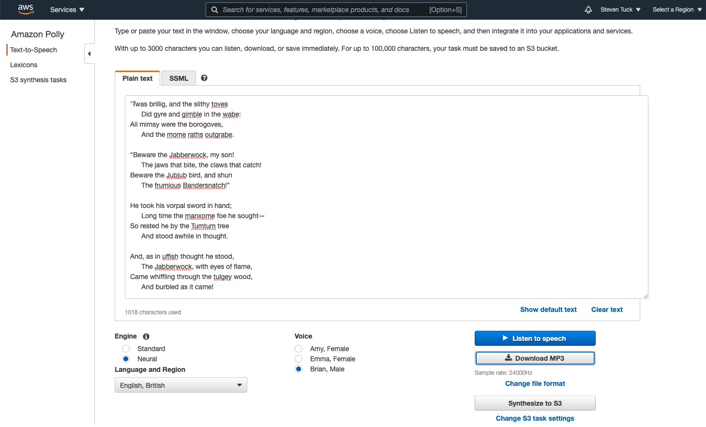

The voices (and tech) used in Amazon Alexa, are available for anyone to play with, free of charge - search for Amazon Polly.

Update: Here's the voice of ["Brian" (British English) reading Lewis Carroll](/speech_20201230_AWS_polly_neural_brian.mp3) with the "Neural" engine setting eanbled.

[Jabberwocky Poem](https://www.poetryfoundation.org/poems-and-poets/poems/detail/42916).

Try Polly yourself [here](https://eu-west-1.console.aws.amazon.com/polly/home/SynthesizeSpeech).
