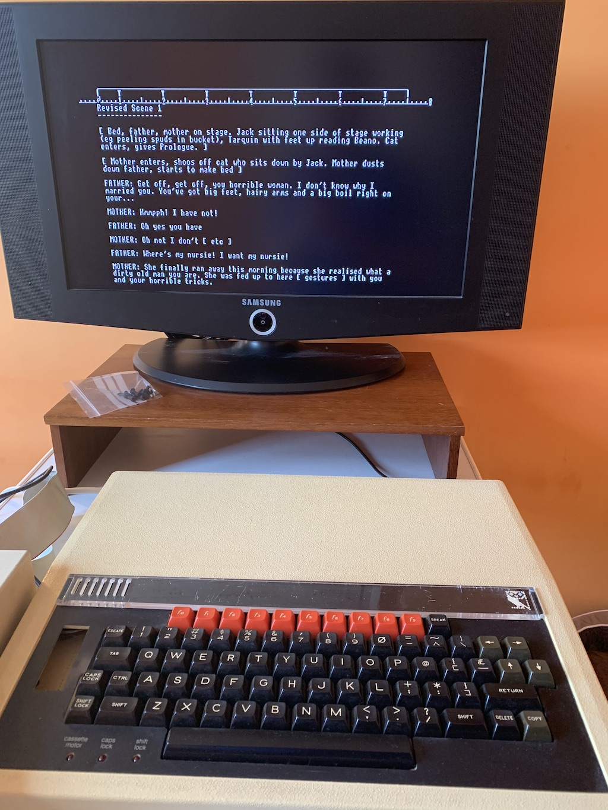
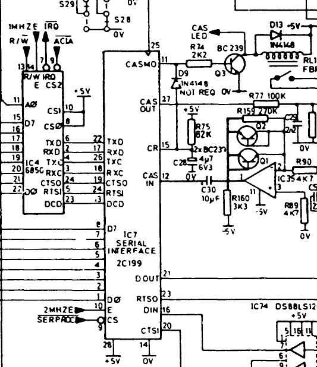
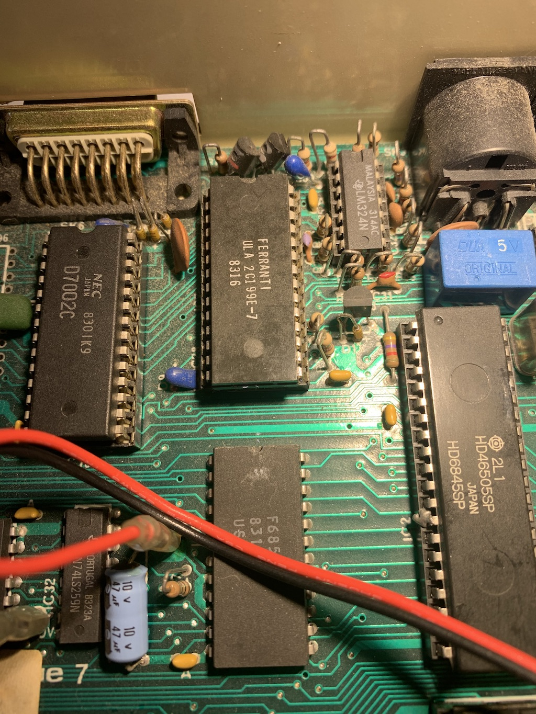
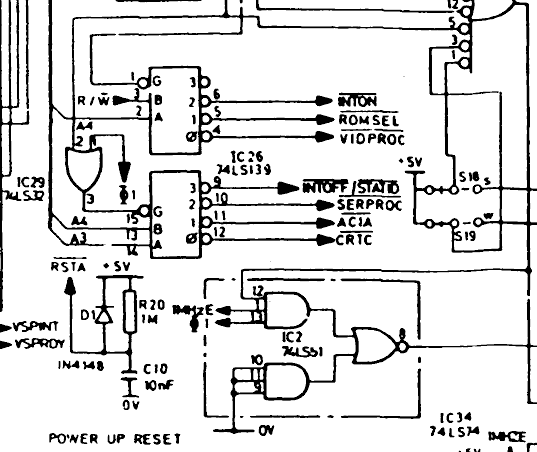
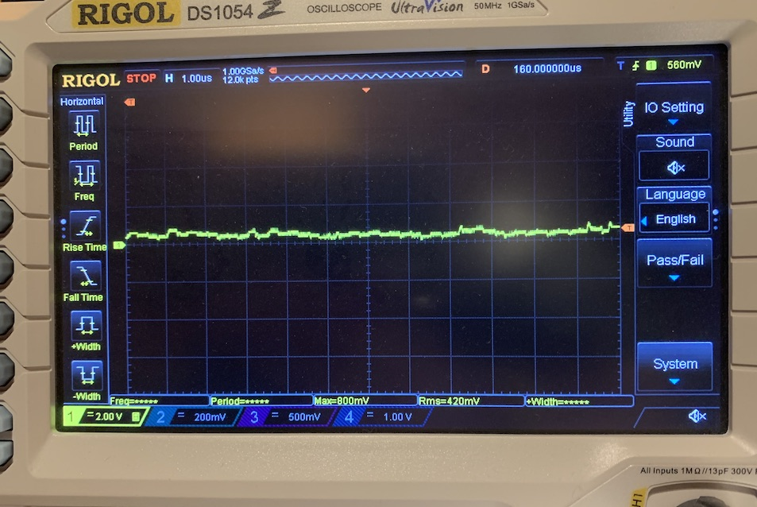
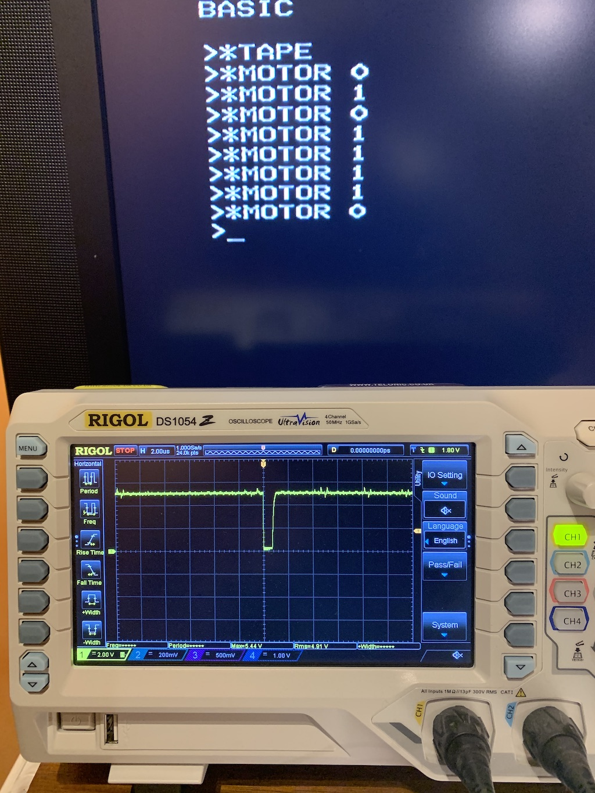
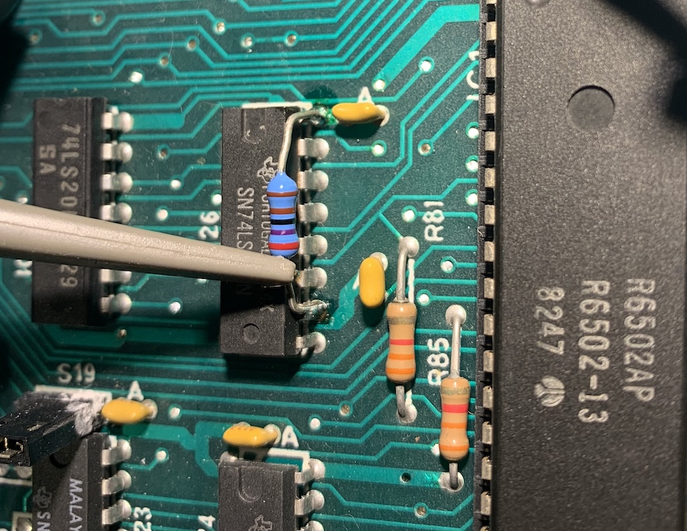
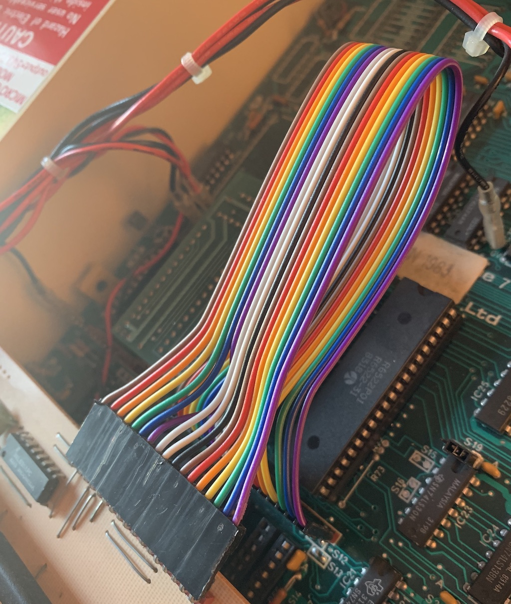

I seem to have collected a few old BBC Micros - approx 1983 vintage, so coming up to 40 years old.

Before powering them up, I took the advice of [Retroclinic](http://www.retroclinic.com/) and replaced the power supply X2 capacitors that are known to fail (damaging the power supply in the process). Retroclinic can also be found on [eBay](https://www.ebay.co.uk/usr/retroclinic).

Rather than use an old-style CRT, a Samsung LCD TV provides a much steadier picture, using an RGB to SCART lead [such as this](https://www.ebay.co.uk/itm/5m-Monitor-Lead-Cable-for-Acorn-BBC-B-Micro-6Pin-DIN-to-TV-Monitor-RGB-Scart/181375770568?hash=item2a3ad69fc8:g:jtwAAOxyZwpSVBqN).



All the machines powered on and appeared to work fine, except one (not the one pictured here) had the "cassette" light stuck on and would not respond to commands such as

```
*TAPE
*MOTOR 0
```

and so on.

One of the nice things about this generation of computers is that the circuit is (relatively) simple, and the chips are all DIL packages with 0.1" spacing so not too fiddly to work with.

## The Serial ULA

Looking at the circuit diagram, the "serial ULA" IC7 has an output on pin 11, "CASMO", which is active high. This goes through Q3, a BC239 transistor to buffer the signal, driving both the LED near the keyboard, and the relay.



I don't really need the cassette interface, as I have a 5.25" floppy drive for this machine; however it wasn't good to leave an undiagnosed fault.

Probing this with a scope, the line was actually flickering on and off very rapidly - way too fast for a relay to follow. This didn't look right.

ULA stands for "uncommitted logic array". The part code is 2C199E, with a date code indicating the 16th week of 1983. These were semi-custom chips made by Ferranti specially for Acorn. I doubt you will find a data sheet for them, but there is a brief description of the role the chip plays, in chapter 20 of "[The Advanced User Guide for the BBC Micro](http://stardot.org.uk/mirrors/www.bbcdocs.com/filebase/essentials/BBC%20Microcomputer%20Advanced%20User%20Guide.pdf)" by Bray, Dickens & Holmes. There is also some information [here](http://beebwiki.mdfs.net/Serial_ULA).



A quick email exchange with Mark of Retroclinic - and to my surprise, he has "new old stock" serial ULAs! These are newer parts (VC2026 or VTi2026) made by VLSI inc, but are pin compatible.

The part is easy to change as it's socketed - however the fault was still there. Boo!

Time to look a bit deeper - why was that output line pulsing high and low - the CPU should not be accessing it particularly often, unless the cassette or serial ports are being used.

## Chip Select logic

I/O for 8-bit machines, particularly those based on the 6502 CPU, is pretty simple. Specific memory addresses are used to read/write the peripherals. Much of the address decode logic is built from 74LSxxx TTL parts which have data-sheets. Here's the relevant bit:



The serial processor is accessed when the line \*SERPROC is driven (active low, so should be sitting near +5v most of the time, with occasional low pulses). Instead, it looked like this:



IC26, a [74LS139](http://www.ti.com/lit/ds/symlink/sn74ls139a.pdf), provides this signal from its pin 10. Why is it whiffling around near 0v most of the time? Sometimes TTL logic has "open collector" outputs that need to be pulled high via a resistor; this is not the case with the '139 part, and I couldn't find a pull-up resistor on the original schematic.

Perhaps the upper drive transistor of IC26 had failed - either through age, or perhaps the serial ULA actually had gone faulty and taken too much current from it.

Anyway, it was easy to try an experiment - just hold, by hand, a pull-up resistor from IC26 pin 10 to the nearby +5v (pin 16). It worked!

This told us IC26 was faulty; however it's soldered in and therefore, a pain to change.

Here's the \*SERPROC signal following the addition of the pullup - looks OK to me.



In single-trace mode, the scope is showing the \*SERPROC signal going briefly low (for around 1 microsecond) as the \*MOTOR command is used to flip the state.

I fitted a 2k7 resistor, just tagging on to the legs of IC26. I chose the value to provide a reasonably fast rise time while consuming less than 2mA (the 74LS139 output max is rated as 8mA).



Pull-up resistor fitted to IC26

If I ever need to take the PCB out of the machine, I might replace the chip, but in the meantime this is works.

Just for fun, I tried putting the old serial ULA back in, and the cassette motor worked fine with that too. So it was the chip select logic all along!

## Keyboard ribbon cable

The keyboard ribbon cable in this machine had several lines broken. The connector is 0.1" pitch, and uses insulation-displacement connectors that seem to get fragile over time.

After unsuccessful repair attempts on the original ribbon, I replaced it with a standard 0.1" (2.54mm) pitch modern ribbon cable that uses crimp connectors (sometimes referred to as DuPont style connectors).

I tried making these up myself, but they are much more fiddly than they look and the tool I bought (an eBay £10 item) was not up to the job.

Ready-made cable harnesses are easily available from eBay at modest cost, [like these](https://www.ebay.co.uk/itm/401574503715). I bought five 20-way ones, which can be easily cut down to the (weird) 17-way size that the BBC Micro uses.

One snag: the modern DuPont pin style is subtly, but noticeably slimmer than the old BBC Micro PCB pin headers. I solved this by carefully widening the plastic housing entrance on the female (socket) side using a 1.5mm drill bit.

With a bit of persuasion it fits tightly but OK, and looks like this.



Replacement 17-way ribbon. Pin 1 on the left = brown.

The extra cable length is no problem, and actually makes accessing the main board with keyboard removal easier.