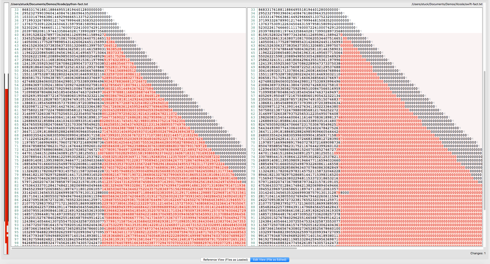

Swift 3 has a ["decimal" number type](https://developer.apple.com/documentation/foundation/nsdecimalnumber) that can represent values such as 0.3 that  are inexactly represented in Double or Float types.  According to this article:

> An instance can represent any number that can be expressed as `mantissa x 10^exponent` where mantissa is a decimal integer up to 38 digits long, and exponent is an integer from –128 through 127.

Note this is _not the same_ as Python's [arbitrary-precision integer](https://rushter.com/blog/python-integer-implementation/) arithmetic. This shows up clearly when using Python (on the left) and Swift (on the right) to generate factorial numbers.  Differences start to show up at `40!` and continue from there.

Not too surprising perhaps, given that Swift has a mantissa + exponent structure underlying its data type, albeit in decimal rather than binary. I just thought it was pretty to look at.