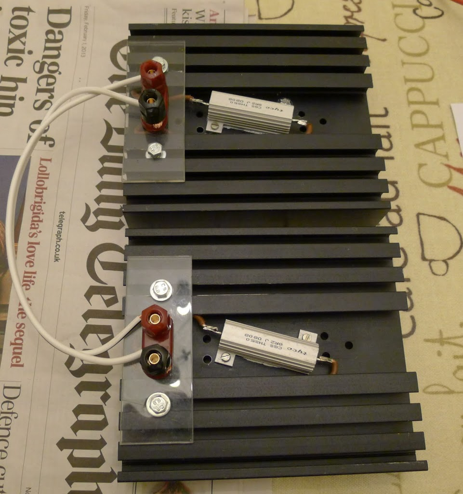
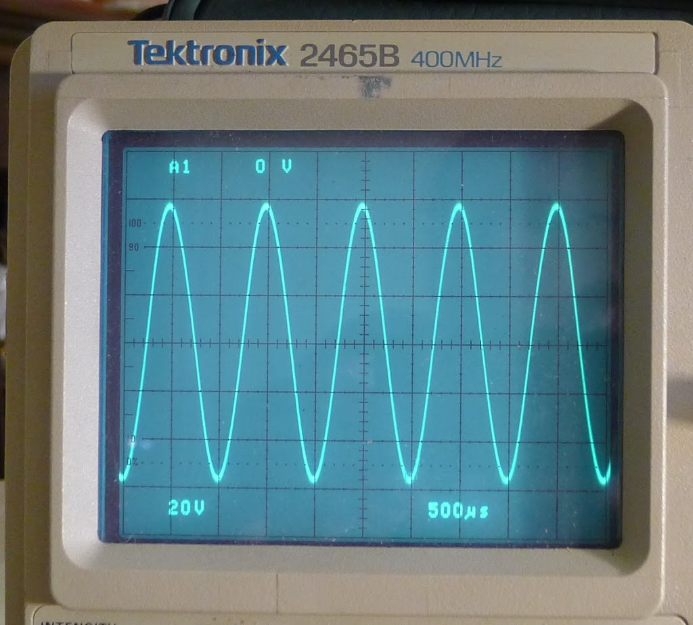
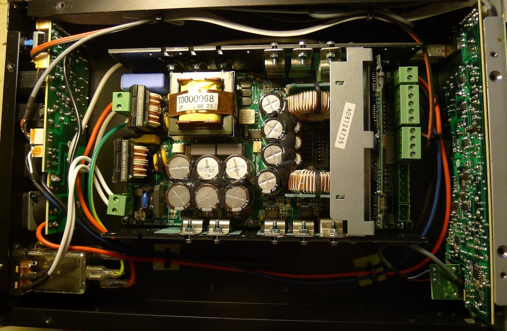
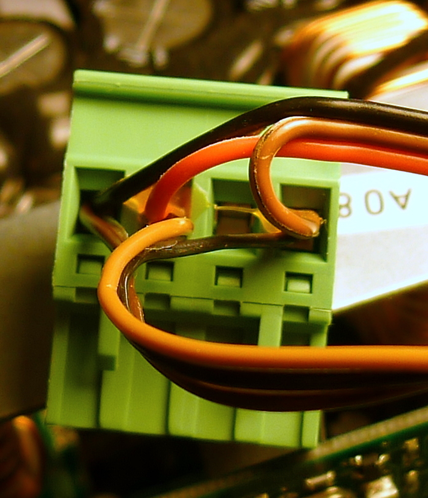
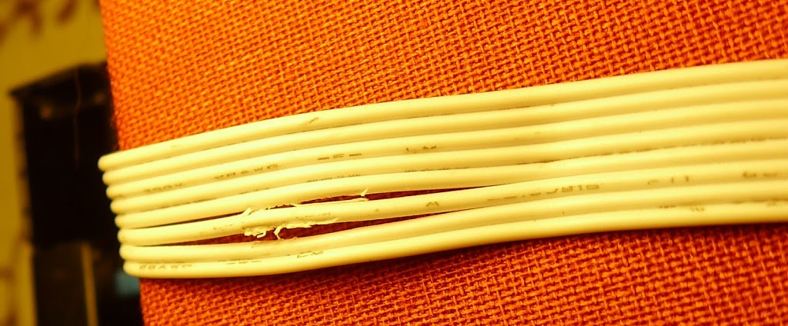
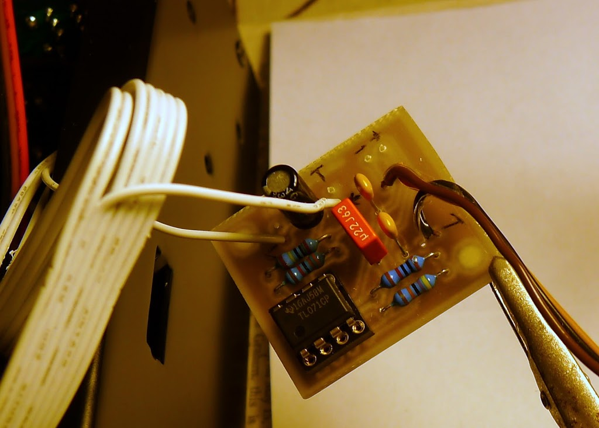
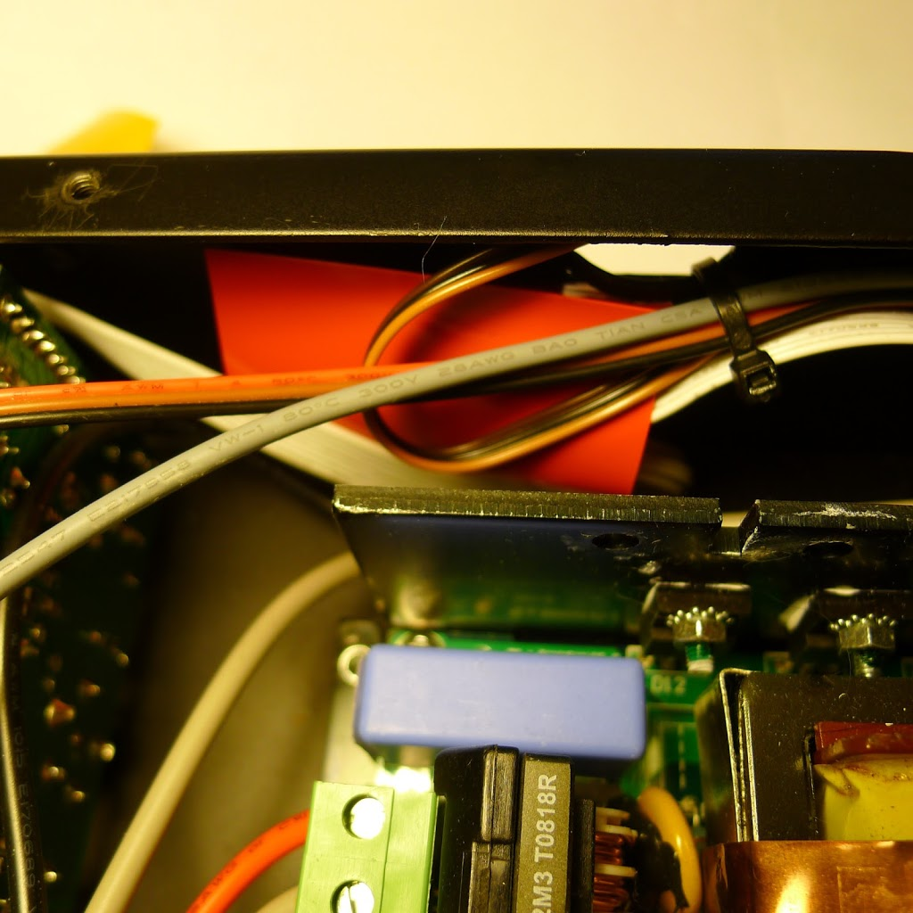

I have an Ashdown Little Giant amp.  Several reviewers have mentioned that this amp is not at loud as it should be (e.g. [here](http://www.talkbass.com/reviews/showproduct.php/product/1334/title/ashdown-little-giant-1000/cat/25)).

It all depends on whether the output levels coming from your bass are enough to drive the output stage fully.  I have an active bass, but even with the input set on max, to get a decent output level I need the output volume control set to around 3 o'clock.

While there are workarounds available, e.g. use an effects send/return through a pedal which has some gain, I wanted a simple 'no extra boxes' solution to go with my lightweight cab.

A nice chap called Wilfried Klaas has come up with what I consider to be the perfect solution to this - adding an extra small preamp (gain) stage inside the amp itself. His [web page](http://klaas.homeip.net/wb/pages/diy/amps/ashdown-little-giant-350.php) (in German) describes this improvement.

Wilfried was very helpful and supplied me a ready-made amp board for around €15.00.  This was fairly straightforward to fit.  I've recorded the process of testing the amp, fitting the board, and re-testing the amp.

Incidentally - my amp, purchased off Ebay, started off life as a green-front, LG350.  However something strange had been done to it, the fan was wired to run continuously off the 12v supply, rather than being connected to the variable-speed fan output.  Eventually the power module failed, and it went back to Ashdown, who replaced it with a [Powersoft Digimod 1000](http://www.powersoft-audio.com/en/products/amp-modules/digimod/digimod-1000.html) module.  Only one side is connected and used, so I have effectively an "LG500".

### 1.  Measure the amp's existing output

First, I hooked up the amp's instrument input to a sine-wave source.  I used a 1kHz, 0dB digital source, loaded as a .wav file onto an IPod.  The output from the iPod was checked on a scope; above 90% volume there were some signs of clipping (presumably the iPod's headphone output stage).  This input level was just enough to light up the 'peak' light on the LG's input stage.

The amp output was connected to a 4 ohm dummy load, which I made as follows - two 8.2 ohm resistors on big heatsinks, connected in parallel, as shown here.

For the actual test, these were placed on a metal tray, on a wooden board, as they _will_ get hot if you run the amp into the loads for more than a few seconds.

With a sine wave input, the amp produced a maximum output of around +/- 60 volts peak, shown here:

]

 The RMS power in a sine wave is

    (V^2 / R) / (sqrt(2))  =  (3600 / 4) / 1.41 = 636 watts

After a few seconds,  some kind of power limiter kicks in, presumably in the power amp module itself, and the output falls to 44 volts peak, which is

     (1936 / 4) / 1.41 = 343 watts.

So the amp can produce more than the rated power (for short periods), the problem is down to lack of gain.

### 2.  Fitting the "Wilfried Klass" buffer stage

Firstly, switch the amp off and unplug the mains lead, leaving the load connected to dissipate the internal power, and take the top off the amp case.  The cooling fan has a 3-pin connector which looks very similar to PC-type cooling fans, this is easy to remove.

Inside of Little Giant amp

The white wires on the bottom left carry mains electricity, and even the +/- 60v output from the amp could deliver a shock, so always work with the power off.

The module requires + / - 12v DC power and an earth, which are obtained from the green connector following Wilfried's instructions.

Power connector On Digimod 1000 module

The next step is to find and break into the grey ribbon cable that goes from front to back. , on the right side of the amp.

The third wire from the bottom carries the preamp signal.   This needs to be picked out of the ribbon and cut into.  I used the scope at this point to check that the sine wave signal was indeed on pin 3 before I cut into it. I broke into the cable carefully using a craft knife:

The buffer circuit is then connected up, with the input coming from the front panel, and the output going towards the back panel:

I then powered up and tested the amp was working, but this time maximum output was reached (before onset of clipping) at a lower setting on the output knob.  The limiter behaviour is the same as before.

Finally, the buffer circuit was fitted into the insulating sleeve supplied by Wilfried (red colour in the picture below).  I used double-sided sticky tape to secure this to the inside of the case, and tie-wraps to keep the wiring in place.

Having just used the amp in a band rehearsal, I would say it's a great improvement - performance volume levels can be reached, while there's still some 'reserve' on the output knob.  There is no appreciable increase in the level of hiss or hum from the amp (it's pretty quiet both before and after the mod).

So thanks to Wilfried for making an OK amp (available for reasonable money on EBay) into a great little amp.