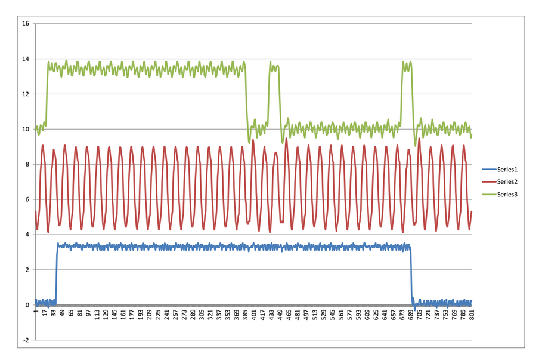

I recently got one of these [great little digital scopes](http://www.rigol-uk.co.uk/Rigol-DS1074Z-Digital-Oscilloscope-p/ds1074z.htm#.VdrwaNNVhBc).  It has a few serial bus decoding packages (on a try-before-buy basis).  You get 36 hours to play with them.  Unfortunately they don't include I2S bus decoding.  I2S is a [bus standard](https://en.wikipedia.org/wiki/I%C2%B2S) commonly used for transferring digital audio around, for example between ADCs and DACs.

No matter! You can capture and export full-resolution traces of signals via a USB memory stick. This seems to work best if the stick is FAT formatted rather than FAT32.  The file format is .CSV which is great for importing into Excel and viewing.  You can then use Excel's charting function to provide a decode of your signals with much greater time-resolution than you can see on the scope's display itself (which is still pretty good).  For example



You can also parse the .CSV file and decode signals quite easily using scripting languages such as PHP, giving outputs in binary, hex or whatever you like - e.g.

```
Using logic threshold of 1.900000 volts
00000000 00001000 00000000 001 Bits:27 Hex: 00004001 #0:64
     540 LRCLK edge    1: 00000000 00000000 00110000 00000001  Bits:32 Hex: 00003001 #1:48
    1191 LRCLK edge    2: 00000000 00000000 00010000 00000001  Bits:32 Hex: 00001001 #2:16
    1842 LRCLK edge    3: 00000000 00000000 01010000 00000001  Bits:32 Hex: 00005001 #3:80
    2494 LRCLK edge    4: 11111010 10000011 11110000 00000001  Bits:32 Hex: fa83f001 #4:-359440
    3145 LRCLK edge    5: 00000000 00000000 00100000 00000001  Bits:32 Hex: 00002001 #5:32
    3796 LRCLK edge    6: 00000000 00000000 00010000 00000001  Bits:32 Hex: 00001001 #6:16
    4447 LRCLK edge    7: 00000000 00000000 00010000 00000001  Bits:32 Hex: 00001001 #7:16
    5098 LRCLK edge    8: 11111111 11111111 10100000 00000001  Bits:32 Hex: ffffa001 #0:-96
    5749 LRCLK edge    9: 00000000 00000000 00010000 00000001  Bits:32 Hex: 00001001 #1:16
    6400 LRCLK edge   10: 11111111 11111111 11000000 00000001  Bits:32 Hex: ffffc001 #2:-64
```

Here's the code - updated to read the signals on the correct edge

```php
<?php

// Decode I2S data captured in CSV file from Rigol DS1054Z scope
// Assumptions:  First two rows in the file are header lines - skip these.
//
// Channels are arranged as :  CH1 = BCLK, CH2 = LRCLK, CH3 = DOUT,  CH4 = scopetrig

// Command line parameters: <inputfile> <voltage threshold>
// threshold of 1.8 or 1.9 volts seems to be reliable with 3.3v logic.
//
// Fixed to toggle in data on rising edges of BCLK

if($argv[1] == "") {
 exit("Usage: ".$argv[0]." input_file [voltage_threshold]n");
}

// Get parameters
$fp = fopen($argv[1], "r");

if($argv[2] == "") {
 $threshold = 1.8;
 }
else {
 $threshold = (float)$argv[2];  //Volts
}


if(is_numeric($threshold)) {
 print("Using logic threshold of ".sprintf("%f", $threshold)." voltsn");
}
else {
 exit("voltage threshold must be a numeric value");
}

// Skip the two expected header lines
$ln = fgetcsv($fp);
$ln = fgetcsv($fp);

$i=1;

// Get the first line of real data in
$ln = fgetcsv($fp);
$bclk = $ln[0];
$lrclk = $ln[1];
$dout = $ln[2];

// Set up initial trigger conditions
$bclkTrig = $bclk;
$lrclkTrig = $lrclk;

//Count edges as they happen
$bclkEdgeCount = 0;
$lrclkEdgeCount = 0;
$doneLSB = false;

// Collect bits into this shift register
$bitcount = 0;
$doutShiftReg = 0;

while(!feof($fp)) {
 $i=$i+1;
 $ln = fgetcsv($fp);

 $bclk = $ln[0];
 $lrclk = $ln[1];
 $dout = $ln[2];

 // Check for a RISING edge in BCLK
 if(($bclkTrig <$threshold) && ($bclk >= $threshold) ) {
  $bclkEdgeCount++;

  // Check if the LRCLK line has changed state since the last edge
  if( ($lrclkTrig >$threshold) <> ($lrclk >$threshold)) {
   // Dump out hex value accumulated so far, the count of bits in this sample, and decimal equivalent
   $hexnum = sprintf("%08x", $doutShiftReg);

   // Handle 2-s complement sign conversion for the 24-bit audio
   $signedSample = $doutShiftReg >> 8;
   if($signedSample >= 2\*\*23 -1) {
    $signedSample = $signedSample - (2\*\*24);
   }

   echo " Bits:".$bitcount." Hex: ".$hexnum." #".($lrclkEdgeCount %8).":".$signedSample;
   $lrclkEdgeCount++;
   echo "n".sprintf("%8d",$i)." LRCLK edge ".sprintf("%4d",$lrclkEdgeCount).": ";
   $lrclkTrig = $lrclk;

   // Start accumulating bits into the shift register
   $bitcount = 0;
   $doutShiftReg = 0;
  }


  // output raw data, and accumulate it into shift register
  if($dout > $threshold) $doutBit = 1; else $doutBit = 0;
  echo $doutBit;
  $bitcount++;
  if($bitcount %8 == 0) echo " ";    // pretty-print spacing

  $doutShiftReg = ($doutShiftReg <<1) + $doutBit;
 }
 // this is the new value we'll compare against
 $bclkTrig = $bclk;

}
echo "n";
?>
```

Using the program, it's possible to capture I2S signals and decode them as follows. This is data from a Behringer P16I device, through a Wolfson WM8804 evaulation board:

```
Using logic threshold of 1.900000 volts
0000001 Bits:7 Hex: 00000001 #0:0
     132 LRCLK edge    1: 11111111 11111111 11000000 00000001  Bits:32 Hex: ffffc001 #1:-64
     783 LRCLK edge    2: 11111111 11111111 10100000 00000001  Bits:32 Hex: ffffa001 #2:-96
    1434 LRCLK edge    3: 11111111 11111111 01100000 00000001  Bits:32 Hex: ffff6001 #3:-160
    2086 LRCLK edge    4: 11111111 11111111 01110000 00000001  Bits:32 Hex: ffff7001 #4:-144
    2737 LRCLK edge    5: 00000000 00000000 00100000 00000001  Bits:32 Hex: 00002001 #5:32
    3388 LRCLK edge    6: 11111111 11111111 11010000 00000001  Bits:32 Hex: ffffd001 #6:-48
    4039 LRCLK edge    7: 11111111 11111111 10010000 00000001  Bits:32 Hex: ffff9001 #7:-112
    4690 LRCLK edge    8: 00000000 00000000 01100000 00000001  Bits:32 Hex: 00006001 #0:96
    5341 LRCLK edge    9: 11111111 11111110 11110000 00000001  Bits:32 Hex: fffef001 #1:-272
    5992 LRCLK edge   10: 11111111 11111111 10110000 00000001  Bits:32 Hex: ffffb001 #2:-80
    6643 LRCLK edge   11: 00000000 00000000 01110000 00000001  Bits:32 Hex: 00007001 #3:112
    7294 LRCLK edge   12: 00000000 00000000 11010000 00000001  Bits:32 Hex: 0000d001 #4:208
    7945 LRCLK edge   13: 00000000 00000000 01100000 00000001  Bits:32 Hex: 00006001 #5:96
    8596 LRCLK edge   14: 00000000 00000000 00010000 00000001  Bits:32 Hex: 00001001 #6:16
    9247 LRCLK edge   15: 00000000 00000000 10010000 00000001  Bits:32 Hex: 00009001 #7:144
    9898 LRCLK edge   16: 11111111 11111111 01010000 00000001  Bits:32 Hex: ffff5001 #0:-176
   10549 LRCLK edge   17: 11111111 11111111 10110000 00000001  Bits:32 Hex: ffffb001 #1:-80
   11200 LRCLK edge   18: 00000000 00000000 01000000 00000001  Bits:32 Hex: 00004001 #2:64
   11851 LRCLK edge   19: 00000000 00000000 01100000 00000001  Bits:32 Hex: 00006001 #3:96
   12502 LRCLK edge   20: 11111111 11111111 10110000 00000001  Bits:32 Hex: ffffb001 #4:-80
   13153 LRCLK edge   21: 00000000 00000000 10100000 00000001  Bits:32 Hex: 0000a001 #5:160
   13804 LRCLK edge   22: 00000000 00000000 00010000 00000001  Bits:32 Hex: 00001001 #6:16
   14455 LRCLK edge   23: 11111111 11111111 10000000 00000001  Bits:32 Hex: ffff8001 #7:-128
   15106 LRCLK edge   24: 00000000 00000000 10000000 00000001  Bits:32 Hex: 00008001 #0:128
   15758 LRCLK edge   25: 11111111 11111111 10010000 00000001  Bits:32 Hex: ffff9001 #1:-112
   16409 LRCLK edge   26: 11111111 11111111 10100000 00000001  Bits:32 Hex: ffffa001 #2:-96
   17060 LRCLK edge   27: 00000000 00000000 00000000 00000001  Bits:32 Hex: 00000001 #3:0
   17711 LRCLK edge   28: 00000000 00000000 00000000 00000001  Bits:32 Hex: 00000001 #4:0
   18362 LRCLK edge   29: 00000000 00000000 11100000 00000001  Bits:32 Hex: 0000e001 #5:224
   19013 LRCLK edge   30: 00000000 00000000 10000000 00000001  Bits:32 Hex: 00008001 #6:128
   19664 LRCLK edge   31: 00000000 00000000 01010000 00000001  Bits:32 Hex: 00005001 #7:80
   20315 LRCLK edge   32: 00000000 00000000 10100000 00000001  Bits:32 Hex: 0000a001 #0:160
   20966 LRCLK edge   33: 11111111 11111111 11000000 00000001  Bits:32 Hex: ffffc001 #1:-64
   21617 LRCLK edge   34: 11111111 11111110 11110000 00000001  Bits:32 Hex: fffef001 #2:-272
   22268 LRCLK edge   35: 11111111 11111111 10100000 00000001  Bits:32 Hex: ffffa001 #3:-96
   22919 LRCLK edge   36: 00000000 00000000 00110000 00000001  Bits:32 Hex: 00003001 #4:48
   23570 LRCLK edge   37: 00000000 00000000 01000000 00000001  Bits:32 Hex: 00004001 #5:64
   24221 LRCLK edge   38: 11111111 11111111 11100000 00000001  Bits:32 Hex: ffffe001 #6:-32
   24872 LRCLK edge   39: 11111111 11111111 11100000 00000001  Bits:32 Hex: ffffe001 #7:-32
   25523 LRCLK edge   40: 11111111 11111111 11110000 00000001  Bits:32 Hex: fffff001 #0:-16
   26174 LRCLK edge   41: 00000000 00000000 10010000 00000001  Bits:32 Hex: 00009001 #1:144
   26825 LRCLK edge   42: 00000000 00000000 01010000 00000001  Bits:32 Hex: 00005001 #2:80
   27476 LRCLK edge   43: 11111111 11111111 10000000 00000001  Bits:32 Hex: ffff8001 #3:-128
   28127 LRCLK edge   44: 11111111 11111111 01110000 00000001  Bits:32 Hex: ffff7001 #4:-144
   28778 LRCLK edge   45: 00000000 00000001 00000000 00000001  Bits:32 Hex: 00010001 #5:256
   29429 LRCLK edge   46: 11111111 11111111 11110000 00000001  Bits:32 Hex: fffff001 #6:-16
   30080 LRCLK edge   47: 00000000 00000000 01000000 00000001  Bits:32 Hex: 00004001 #7:64
   30732 LRCLK edge   48: 11111111 11111111 00110000 00000001  Bits:32 Hex: ffff3001 #0:-208
   31383 LRCLK edge   49: 00000000 00000000 00010000 00000001  Bits:32 Hex: 00001001 #1:16
   32034 LRCLK edge   50: 00000000 00000000 01000000 00000001  Bits:32 Hex: 00004001 #2:64
   32685 LRCLK edge   51: 00000000 00000000 01110000 00000001  Bits:32 Hex: 00007001 #3:112
   33336 LRCLK edge   52: 11111111 11111111 10010000 00000001  Bits:32 Hex: ffff9001 #4:-112
   33987 LRCLK edge   53: 11111111 11111111 00100000 00000001  Bits:32 Hex: ffff2001 #5:-224
   34638 LRCLK edge   54: 11111111 11111111 01100000 00000001  Bits:32 Hex: ffff6001 #6:-160
   35289 LRCLK edge   55: 11111111 11111111 01100000 00000001  Bits:32 Hex: ffff6001 #7:-160
   35940 LRCLK edge   56: 00000000 00000000 00100000 00000001  Bits:32 Hex: 00002001 #0:32
   36591 LRCLK edge   57: 00000000 00000000 01000000 00000001  Bits:32 Hex: 00004001 #1:64
   37242 LRCLK edge   58: 00000000 00000000 00000000 00000001  Bits:32 Hex: 00000001 #2:0
   37893 LRCLK edge   59: 00000000 00000000 01010000 00000001  Bits:32 Hex: 00005001 #3:80
   38544 LRCLK edge   60: 00000000 00000001 00010000 00000001  Bits:32 Hex: 00011001 #4:272
   39195 LRCLK edge   61: 11111111 11111111 11100000 00000001  Bits:32 Hex: ffffe001 #5:-32
   39846 LRCLK edge   62: 11111111 11111111 11100000 00000001  Bits:32 Hex: ffffe001 #6:-32
   40497 LRCLK edge   63: 00000000 00000000 01110000 00000001  Bits:32 Hex: 00007001 #7:112
   41148 LRCLK edge   64: 11111111 11111111 11110000 00000001  Bits:32 Hex: fffff001 #0:-16
   41799 LRCLK edge   65: 00000000 00000000 00000000 00000001  Bits:32 Hex: 00000001 #1:0
   42450 LRCLK edge   66: 11111111 11111111 10000000 00000001  Bits:32 Hex: ffff8001 #2:-128
   43101 LRCLK edge   67: 11111111 11111110 11100000 00000001  Bits:32 Hex: fffee001 #3:-288
   43753 LRCLK edge   68: 11111111 11111111 10010000 00000001  Bits:32 Hex: ffff9001 #4:-112
   44403 LRCLK edge   69: 00000000 00000000 10000000 00000001  Bits:32 Hex: 00008001 #5:128
   45054 LRCLK edge   70: 00000000 00000000 10000000 00000001  Bits:32 Hex: 00008001 #6:128
   45706 LRCLK edge   71: 00000000 00000000 10100000 00000001  Bits:32 Hex: 0000a001 #7:160
   46357 LRCLK edge   72: 11111111 11111111 01100000 00000001  Bits:32 Hex: ffff6001 #0:-160
   47008 LRCLK edge   73: 11111111 11111111 10000000 00000001  Bits:32 Hex: ffff8001 #1:-128
   47659 LRCLK edge   74: 11111111 11111111 11010000 00000001  Bits:32 Hex: ffffd001 #2:-48
   48310 LRCLK edge   75: 11111111 11111111 01010000 00000001  Bits:32 Hex: ffff5001 #3:-176
   48961 LRCLK edge   76: 00000000 00000000 01000000 00000001  Bits:32 Hex: 00004001 #4:64
   49612 LRCLK edge   77: 00000000 00000000 01110000 00000001  Bits:32 Hex: 00007001 #5:112
   50263 LRCLK edge   78: 11111111 11111111 01110000 00000001  Bits:32 Hex: ffff7001 #6:-144
   50914 LRCLK edge   79: 00000000 00000000 11110000 00000001  Bits:32 Hex: 0000f001 #7:240
   51565 LRCLK edge   80: 00000000 00000000 01100000 00000001  Bits:32 Hex: 00006001 #0:96
   52216 LRCLK edge   81: 11111111 11111110 11110000 00000001  Bits:32 Hex: fffef001 #1:-272
   52867 LRCLK edge   82: 11111111 11111111 10000000 00000001  Bits:32 Hex: ffff8001 #2:-128
   53518 LRCLK edge   83: 00000000 00000000 00010000 00000001  Bits:32 Hex: 00001001 #3:16
   54169 LRCLK edge   84: 00000000 00000000 10010000 00000001  Bits:32 Hex: 00009001 #4:144
   54820 LRCLK edge   85: 00000000 00000000 10110000 00000001  Bits:32 Hex: 0000b001 #5:176
   55471 LRCLK edge   86: 00000000 00000000 10010000 00000001  Bits:32 Hex: 00009001 #6:144
   56122 LRCLK edge   87: 11111111 11111111 10100000 00000001  Bits:32 Hex: ffffa001 #7:-96
   56773 LRCLK edge   88: 00000000 00000000 00100000 00000001  Bits:32 Hex: 00002001 #0:32
   57424 LRCLK edge   89: 11111111 11111111 11110000 00000001  Bits:32 Hex: fffff001 #1:-16
   58075 LRCLK edge   90: 00000000 00000000 10000000 00000001  Bits:32 Hex: 00008001 #2:128
   58727 LRCLK edge   91: 00000000 00000000 01110000 00000001  Bits:32 Hex: 00007001 #3:112
   59378 LRCLK edge   92: 00000000 00000000 10110000 00000001  Bits:32 Hex: 0000b001 #4:176
   60029 LRCLK edge   93: 00000000 00000000 00110000 00000001  Bits:32 Hex: 00003001 #5:48
   60680 LRCLK edge   94: 00000000 00000000 10110000 00000001  Bits:32 Hex: 0000b001 #6:176
   61331 LRCLK edge   95: 11111111 11111111 01010000 00000001  Bits:32 Hex: ffff5001 #7:-176
   61982 LRCLK edge   96: 11111111 11111111 11100000 00000001  Bits:32 Hex: ffffe001 #0:-32
   62633 LRCLK edge   97: 11111111 11111111 10100000 00000001  Bits:32 Hex: ffffa001 #1:-96
   63284 LRCLK edge   98: 11111111 11111111 11010000 00000001  Bits:32 Hex: ffffd001 #2:-48
   63935 LRCLK edge   99: 11111111 11111111 11110000 00000001  Bits:32 Hex: fffff001 #3:-16
   64586 LRCLK edge  100: 11111111 11111111 10100000 00000001  Bits:32 Hex: ffffa001 #4:-96
   65237 LRCLK edge  101: 00000000 00000000 01100000 00000001  Bits:32 Hex: 00006001 #5:96
   65888 LRCLK edge  102: 11111111 11111111 11100000 00000001  Bits:32 Hex: ffffe001 #6:-32
   66539 LRCLK edge  103: 11111111 11111111 11110000 00000001  Bits:32 Hex: fffff001 #7:-16
   67190 LRCLK edge  104: 11111111 11111111 10010000 00000001  Bits:32 Hex: ffff9001 #0:-112
   67841 LRCLK edge  105: 11111111 11111111 11110000 00000001  Bits:32 Hex: fffff001 #1:-16
   68492 LRCLK edge  106: 11111111 11111111 01110000 00000001  Bits:32 Hex: ffff7001 #2:-144
   69143 LRCLK edge  107: 00000000 00000000 10010000 00000001  Bits:32 Hex: 00009001 #3:144
   69794 LRCLK edge  108: 11111111 11111111 11100000 00000001  Bits:32 Hex: ffffe001 #4:-32
   70445 LRCLK edge  109: 11111111 11111111 10010000 00000001  Bits:32 Hex: ffff9001 #5:-112
   71096 LRCLK edge  110: 00000000 00000000 00000000 00000001  Bits:32 Hex: 00000001 #6:0
   71747 LRCLK edge  111: 00000000 00000000 10110000 00000001  Bits:32 Hex: 0000b001 #7:176
   72399 LRCLK edge  112: 00000000 00000000 11010000 00000001  Bits:32 Hex: 0000d001 #0:208
   73050 LRCLK edge  113: 11111111 11111111 11110000 00000001  Bits:32 Hex: fffff001 #1:-16
   73701 LRCLK edge  114: 11111111 11111111 01110000 00000001  Bits:32 Hex: ffff7001 #2:-144
   74352 LRCLK edge  115: 11111111 11111111 01100000 00000001  Bits:32 Hex: ffff6001 #3:-160
   75003 LRCLK edge  116: 11111111 11111111 11110000 00000001  Bits:32 Hex: fffff001 #4:-16
   75654 LRCLK edge  117: 11111111 11111111 10110000 00000001  Bits:32 Hex: ffffb001 #5:-80
   76305 LRCLK edge  118: 11111111 11111111 10110000 00000001  Bits:32 Hex: ffffb001 #6:-80
   76956 LRCLK edge  119: 11111111 11111111 10110000 00000001  Bits:32 Hex: ffffb001 #7:-80
   77607 LRCLK edge  120: 11111111 11111111 11010000 00000001  Bits:32 Hex: ffffd001 #0:-48
   78258 LRCLK edge  121: 11111111 11111111 11010000 00000001  Bits:32 Hex: ffffd001 #1:-48
   78909 LRCLK edge  122: 11111111 11111111 11010000 00000001  Bits:32 Hex: ffffd001 #2:-48
   79560 LRCLK edge  123: 11111111 11111111 01110000 00000001  Bits:32 Hex: ffff7001 #3:-144
   80211 LRCLK edge  124: 11111111 11111111 01110000 00000001  Bits:32 Hex: ffff7001 #4:-144
   80862 LRCLK edge  125: 11111111 11111111 11100000 00000001  Bits:32 Hex: ffffe001 #5:-32
   81513 LRCLK edge  126: 11111111 11111111 11010000 00000001  Bits:32 Hex: ffffd001 #6:-48
   82164 LRCLK edge  127: 11111111 11111111 10100000 00000001  Bits:32 Hex: ffffa001 #7:-96
   82815 LRCLK edge  128: 00000000 00000000 01100000 00000001  Bits:32 Hex: 00006001 #0:96
   83466 LRCLK edge  129: 00000000 00000000 00100000 00000001  Bits:32 Hex: 00002001 #1:32
   84117 LRCLK edge  130: 00000000 00000000 10000000 00000001  Bits:32 Hex: 00008001 #2:128
   84768 LRCLK edge  131: 00000000 00000000 11110000 00000001  Bits:32 Hex: 0000f001 #3:240
   85420 LRCLK edge  132: 00000000 00000000 01010000 00000001  Bits:32 Hex: 00005001 #4:80
   86071 LRCLK edge  133: 00000000 00000000 00110000 00000001  Bits:32 Hex: 00003001 #5:48
   86722 LRCLK edge  134: 11111111 11111111 11000000 00000001  Bits:32 Hex: ffffc001 #6:-64
   87373 LRCLK edge  135: 11111111 11111111 10010000 00000001  Bits:32 Hex: ffff9001 #7:-112
   88024 LRCLK edge  136: 11111111 11111111 11110000 00000001  Bits:32 Hex: fffff001 #0:-16
   88675 LRCLK edge  137: 11111111 11111111 10100000 00000001  Bits:32 Hex: ffffa001 #1:-96
   89326 LRCLK edge  138: 00000000 00000001 00000000 00000001  Bits:32 Hex: 00010001 #2:256
   89977 LRCLK edge  139: 11111111 11111111 10010000 00000001  Bits:32 Hex: ffff9001 #3:-112
   90628 LRCLK edge  140: 00000000 00000000 10000000 00000001  Bits:32 Hex: 00008001 #4:128
   91279 LRCLK edge  141: 00000000 00000000 00010000 00000001  Bits:32 Hex: 00001001 #5:16
   91930 LRCLK edge  142: 00000000 00000000 11000000 00000001  Bits:32 Hex: 0000c001 #6:192
   92581 LRCLK edge  143: 00000000 00000000 00010000 00000001  Bits:32 Hex: 00001001 #7:16
   93232 LRCLK edge  144: 11111111 11111111 01000000 00000001  Bits:32 Hex: ffff4001 #0:-192
   93883 LRCLK edge  145: 00000000 00000000 11000000 00000001  Bits:32 Hex: 0000c001 #1:192
   94534 LRCLK edge  146: 00000000 00000000 00100000 00000001  Bits:32 Hex: 00002001 #2:32
   95185 LRCLK edge  147: 00000000 00000000 01000000 00000001  Bits:32 Hex: 00004001 #3:64
   95836 LRCLK edge  148: 11111111 11111111 10100000 00000001  Bits:32 Hex: ffffa001 #4:-96
   96487 LRCLK edge  149: 11111111 11111111 10110000 00000001  Bits:32 Hex: ffffb001 #5:-80
   97138 LRCLK edge  150: 00000000 00000000 01110000 00000001  Bits:32 Hex: 00007001 #6:112
   97789 LRCLK edge  151: 11111111 11111111 10110000 00000001  Bits:32 Hex: ffffb001 #7:-80
   98440 LRCLK edge  152: 00000000 00000000 00110000 00001001  Bits:32 Hex: 00003009 #0:48
   99091 LRCLK edge  153: 11111111 11111111 10100000 00001001  Bits:32 Hex: ffffa009 #1:-96
   99742 LRCLK edge  154: 11111111 11111111 11010000 00000001  Bits:32 Hex: ffffd001 #2:-48
  100394 LRCLK edge  155: 00000000 00000000 10100000 00000001  Bits:32 Hex: 0000a001 #3:160
  101045 LRCLK edge  156: 00000000 00000000 00110000 00000001  Bits:32 Hex: 00003001 #4:48
  101696 LRCLK edge  157: 00000000 00000000 10110000 00000001  Bits:32 Hex: 0000b001 #5:176
  102347 LRCLK edge  158: 00000000 00000000 11100000 00000001  Bits:32 Hex: 0000e001 #6:224
  102998 LRCLK edge  159: 00000000 00000000 11010000 00000001  Bits:32 Hex: 0000d001 #7:208
  103649 LRCLK edge  160: 00000000 00000000 10100000 00000001  Bits:32 Hex: 0000a001 #0:160
  104300 LRCLK edge  161: 00000000 00000000 01110000 00000001  Bits:32 Hex: 00007001 #1:112
  104951 LRCLK edge  162: 11111111 11111111 10010000 00000001  Bits:32 Hex: ffff9001 #2:-112
  105602 LRCLK edge  163: 11111111 11111110 11000000 00000001  Bits:32 Hex: fffec001 #3:-320
  106253 LRCLK edge  164: 00000000 00000000 00100000 00000001  Bits:32 Hex: 00002001 #4:32
  106904 LRCLK edge  165: 00000000 00000000 01010000 00000001  Bits:32 Hex: 00005001 #5:80
  107555 LRCLK edge  166: 00000000 00000000 01010000 00000001  Bits:32 Hex: 00005001 #6:80
  108206 LRCLK edge  167: 00000000 00000000 00010000 00000001  Bits:32 Hex: 00001001 #7:16
  108857 LRCLK edge  168: 11111111 11111111 11100000 00000001  Bits:32 Hex: ffffe001 #0:-32
  109508 LRCLK edge  169: 00000000 00000000 01010000 00000001  Bits:32 Hex: 00005001 #1:80
  110159 LRCLK edge  170: 11111111 11111111 01100000 00000001  Bits:32 Hex: ffff6001 #2:-160
  110810 LRCLK edge  171: 11111111 11111111 11100000 00000001  Bits:32 Hex: ffffe001 #3:-32
  111461 LRCLK edge  172: 11111111 11111111 11010000 00000001  Bits:32 Hex: ffffd001 #4:-48
  112112 LRCLK edge  173: 00000000 00000000 00110000 00000001  Bits:32 Hex: 00003001 #5:48
  112764 LRCLK edge  174: 00000000 00000000 10110000 00000001  Bits:32 Hex: 0000b001 #6:176
  113414 LRCLK edge  175: 00000000 00000000 10100000 00000001  Bits:32 Hex: 0000a001 #7:160
  114065 LRCLK edge  176: 11111111 11111111 10100000 00000001  Bits:32 Hex: ffffa001 #0:-96
  114717 LRCLK edge  177: 11111111 11111111 10000000 00000001  Bits:32 Hex: ffff8001 #1:-128
  115368 LRCLK edge  178: 11111111 11111111 11100000 00000001  Bits:32 Hex: ffffe001 #2:-32
  116019 LRCLK edge  179: 00000000 00000000 01110000 00000001  Bits:32 Hex: 00007001 #3:112
  116670 LRCLK edge  180: 00000000 00000000 01010000 00000001  Bits:32 Hex: 00005001 #4:80
  117321 LRCLK edge  181: 11111111 11111111 10110000 00000001  Bits:32 Hex: ffffb001 #5:-80
  117972 LRCLK edge  182: 11111111 11111111 01100000 00000001  Bits:32 Hex: ffff6001 #6:-160
  118623 LRCLK edge  183: 11111111 11111111 10110000 00000001  Bits:32 Hex: ffffb001 #7:-80
  119274 LRCLK edge  184: 00000000 00000000 01100000 00000001  Bits:32 Hex: 00006001 #0:96
  119925 LRCLK edge  185: 11111111 11111111 11110000 00000001  Bits:32 Hex: fffff001 #1:-16
  120576 LRCLK edge  186: 00000000 00000000 10010000 00000001  Bits:32 Hex: 00009001 #2:144
  121227 LRCLK edge  187: 11111111 11111111 11110000 00000001  Bits:32 Hex: fffff001 #3:-16
  121878 LRCLK edge  188: 11111111 11111111 11110000 00000001  Bits:32 Hex: fffff001 #4:-16
  122529 LRCLK edge  189: 11111111 11111111 10100000 00000001  Bits:32 Hex: ffffa001 #5:-96
  123180 LRCLK edge  190: 00000000 00000000 00010000 00000001  Bits:32 Hex: 00001001 #6:16
  123831 LRCLK edge  191: 00000000 00000000 01110000 00000001  Bits:32 Hex: 00007001 #7:112
  124482 LRCLK edge  192: 11111111 11111111 01000000 00000001  Bits:32 Hex: ffff4001 #0:-192
  125133 LRCLK edge  193: 11111111 11111111 11100000 00000001  Bits:32 Hex: ffffe001 #1:-32
  125784 LRCLK edge  194: 11111111 11111111 01100000 00000001  Bits:32 Hex: ffff6001 #2:-160
  126435 LRCLK edge  195: 00000000 00000000 11110000 00000001  Bits:32 Hex: 0000f001 #3:240
  127086 LRCLK edge  196: 00000000 00000001 00010000 00000001  Bits:32 Hex: 00011001 #4:272
  127737 LRCLK edge  197: 11111111 11111111 00110000 00000001  Bits:32 Hex: ffff3001 #5:-208
  128389 LRCLK edge  198: 00000000 00000000 10010000 00000001  Bits:32 Hex: 00009001 #6:144
  129040 LRCLK edge  199: 11111111 11111111 10100000 00000001  Bits:32 Hex: ffffa001 #7:-96
  129691 LRCLK edge  200: 00000000 00000000 01000000 00000001  Bits:32 Hex: 00004001 #0:64
  130342 LRCLK edge  201: 11111111 11111111 10110000 00000001  Bits:32 Hex: ffffb001 #1:-80
  130993 LRCLK edge  202: 00000000 00000000 00010000 00000001  Bits:32 Hex: 00001001 #2:16
  131644 LRCLK edge  203: 00000000 00000000 10010000 00000001  Bits:32 Hex: 00009001 #3:144
  132295 LRCLK edge  204: 11111111 11111111 11010000 00000001  Bits:32 Hex: ffffd001 #4:-48
  132946 LRCLK edge  205: 00000000 00000000 00010000 00000001  Bits:32 Hex: 00001001 #5:16
  133597 LRCLK edge  206: 11111111 11111111 01000000 00000001  Bits:32 Hex: ffff4001 #6:-192
  134248 LRCLK edge  207: 00000000 00000000 11100000 00000001  Bits:32 Hex: 0000e001 #7:224
  134899 LRCLK edge  208: 00000000 00000000 11110000 00000001  Bits:32 Hex: 0000f001 #0:240
  135550 LRCLK edge  209: 00000000 00000000 00010000 00000001  Bits:32 Hex: 00001001 #1:16
  136201 LRCLK edge  210: 00000000 00000000 01100000 00000001  Bits:32 Hex: 00006001 #2:96
  136852 LRCLK edge  211: 11111111 11111111 10010000 00000001  Bits:32 Hex: ffff9001 #3:-112
  137503 LRCLK edge  212: 11111111 11111111 01100000 00000001  Bits:32 Hex: ffff6001 #4:-160
  138154 LRCLK edge  213: 00000000 00000000 01100000 00000001  Bits:32 Hex: 00006001 #5:96
  138805 LRCLK edge  214: 11111111 11111111 00000000 00000001  Bits:32 Hex: ffff0001 #6:-256
  139456 LRCLK edge  215: 11111111 11111111 10000000 00000001  Bits:32 Hex: ffff8001 #7:-128
  140107 LRCLK edge  216: 11111111 11111111 11000000 00000001  Bits:32 Hex: ffffc001 #0:-64
  140758 LRCLK edge  217: 11111111 11111111 10010000 00000001  Bits:32 Hex: ffff9001 #1:-112
  141409 LRCLK edge  218: 11111111 11111111 11000000 00000001  Bits:32 Hex: ffffc001 #2:-64
  142061 LRCLK edge  219: 00000000 00000000 01110000 00000001  Bits:32 Hex: 00007001 #3:112
  142712 LRCLK edge  220: 00000000 00000000 01110000 00000001  Bits:32 Hex: 00007001 #4:112
  143363 LRCLK edge  221: 00000000 00000000 10010000 00000001  Bits:32 Hex: 00009001 #5:144
  144014 LRCLK edge  222: 11111111 11111111 11010000 00000001  Bits:32 Hex: ffffd001 #6:-48
  144665 LRCLK edge  223: 00000000 00000000 01100000 00000001  Bits:32 Hex: 00006001 #7:96
  145316 LRCLK edge  224: 11111111 11111111 11000000 00000001  Bits:32 Hex: ffffc001 #0:-64
  145967 LRCLK edge  225: 00000000 00000000 11110000 00000001  Bits:32 Hex: 0000f001 #1:240
  146618 LRCLK edge  226: 11111111 11111111 11110000 00000001  Bits:32 Hex: fffff001 #2:-16
  147269 LRCLK edge  227: 11111111 11111111 11000000 00000001  Bits:32 Hex: ffffc001 #3:-64
  147920 LRCLK edge  228: 11111111 11111111 10010000 00000001  Bits:32 Hex: ffff9001 #4:-112
  148571 LRCLK edge  229: 11111111 11111111 11110000 00000001  Bits:32 Hex: fffff001 #5:-16
  149222 LRCLK edge  230: 00000000 00000000 01100000 00000001  Bits:32 Hex: 00006001 #6:96
  149873 LRCLK edge  231: 000000
```

Every N samples (actually every 384 samples), there are two samples with LSB set to 0x09 rather than 0x01. Counting the channels as seen on the front-panel from 1 to 16, these are marking channels 1 and 2 in the first data stream. Channels 8 & 9 are I expect marked in the same way, although I don't have a second WM8804 running on that channel yet.