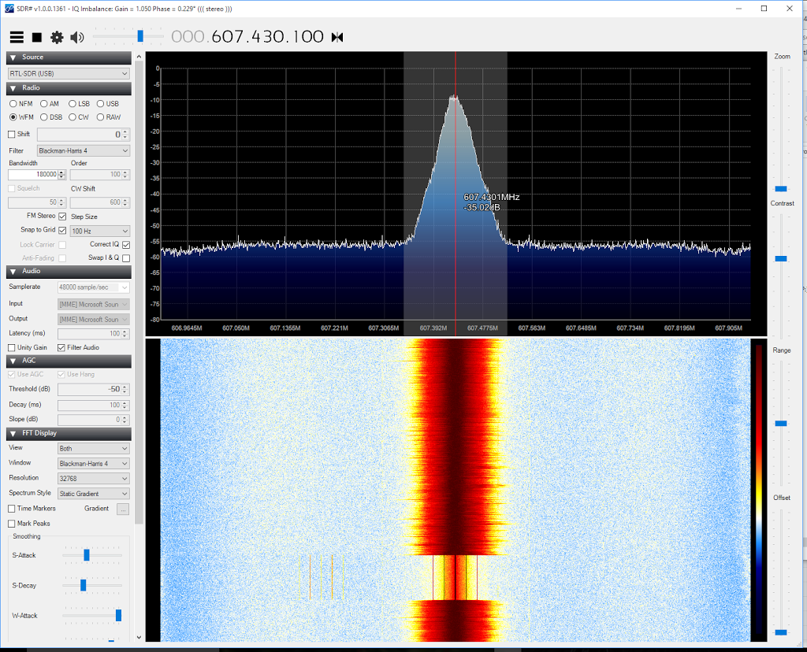

A friend lent me their Shure PSM300 P3T in-ear monitoring system today.  This is a top-of-the-line piece of kit for weekend-warrior type bands, costing over £600 for just one monitor mix.

http://www.shure.com/americas/products/personal-monitor-systems/psm-300-stereo-personal-monitor-system/p3t-half-rack-single-channel-wireless-transmitter

Turns out that the actual RF signal being transmitted is straightforward analog FM.
A £10 USB TV stick and the free SDR# software http://www.rtl-sdr.com/rtl-sdr-quick-start-guide/ can decode the signal and play it out of the sound card output in stereo.

Shure mentions that there is some "24 bit digital" processing - what they call "Patented Shure Audio Reference Companding".  The decoded PC signal does sound a bit swooshy compared to the actual Shure receiver unit, so that would suggest it is doing a bit of companding.