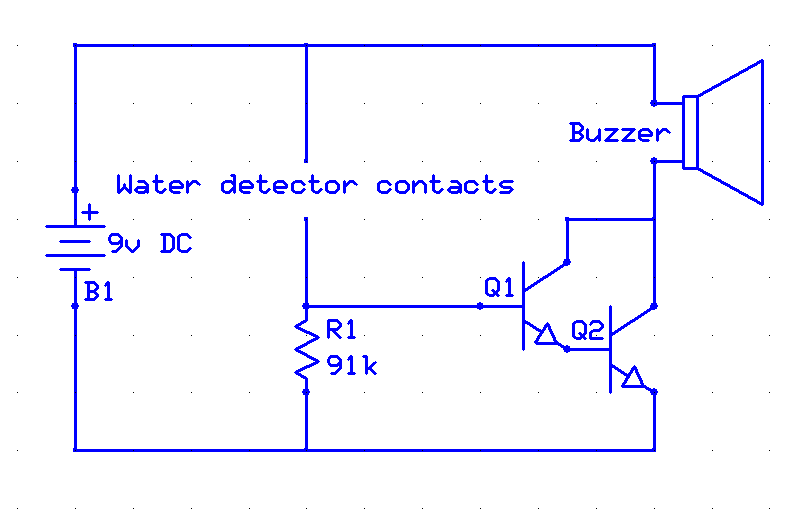
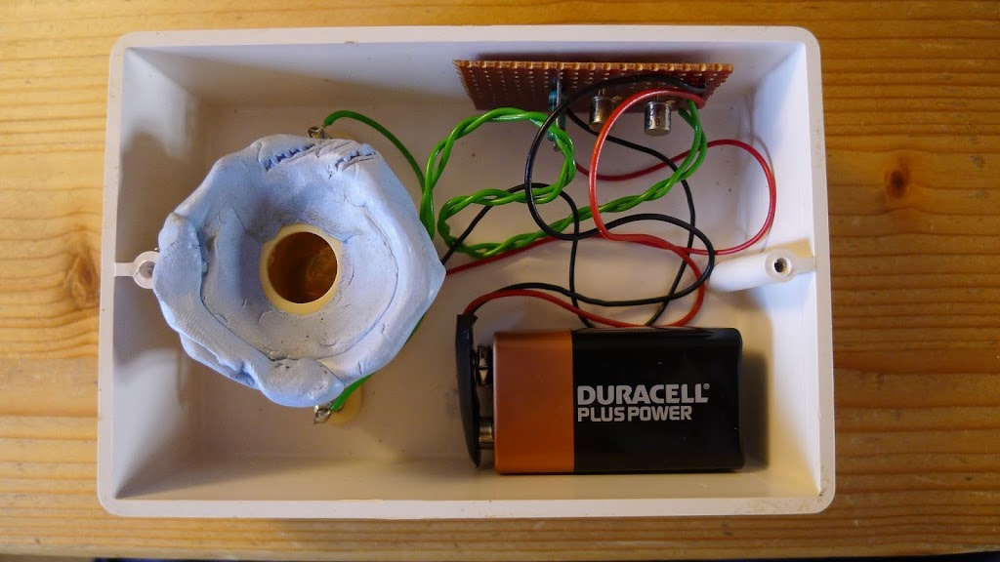

The following circuit is a very simple water leak detector, which I made 25+ years ago (!!) following my fiancée having a washing machine go wrong and leak all over her apartment.

The circuit is not ideal - there are better designs out there. It was built with 'what I had in my scrapbox at the time'.  It's purely analog, relying on the gain of the Darlington pair to provide reasonable on/off behaviour. This can actually be an advantage, as the sound will get louder as the leak becomes more serious and conducts more water.

The transistors used are not critical. I used BC108Cs.

Battery current drain is essentially zero (too low to measure on my meter) when there's no conduction.

The physical construction had a few hacks which surprised me when I took it apart again.

- The self-tapping screws are used both to hold in the buzzer, and act as the electrodes.  Kind-of-neat, but soldering on to them was a nasty little shortcut I'm not proud of!

- The battery is just held in with double-sided tape.  Good enough for something that's rarely changed.

- The circuit board is just loose in the box. Actually I had held it in place with blu-tak before, which was horrible. But the blu-tak seems to absorb moisture and prevents the circuit working properly.

- The plastic box would cut down the sound level too much. So it has holes cut in the box lid to let the sound out.  These holes are then "sealed" using a blu-tak 'grommet' and thin plastic.  Reasonable compromise between letting the sound out and not letting water in!

Here's a pic of the insides.

Nowadays, cheap commercial solutions are easily available such as [this](http://www.amazon.co.uk/Bavaria-BAWM5-Water-Duracell-Battery/dp/B004YK33KQ/ref=sr_1_1?ie=UTF8&qid=1435943219&sr=8-1&keywords=water+detector).
