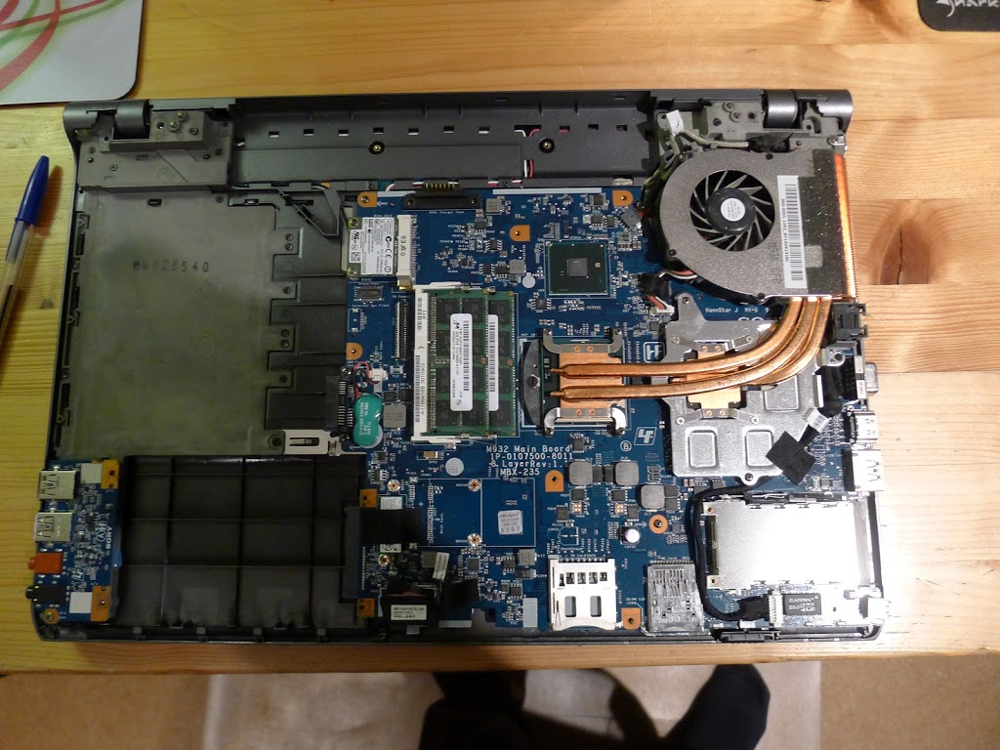
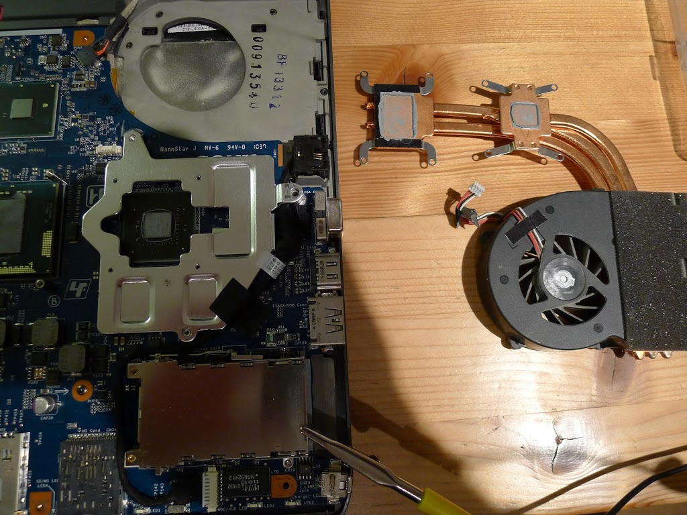
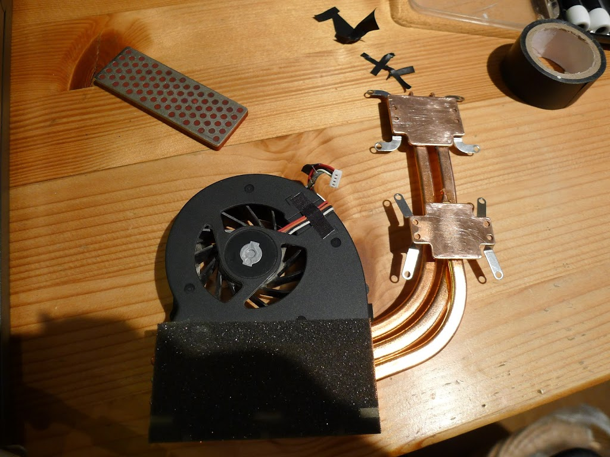
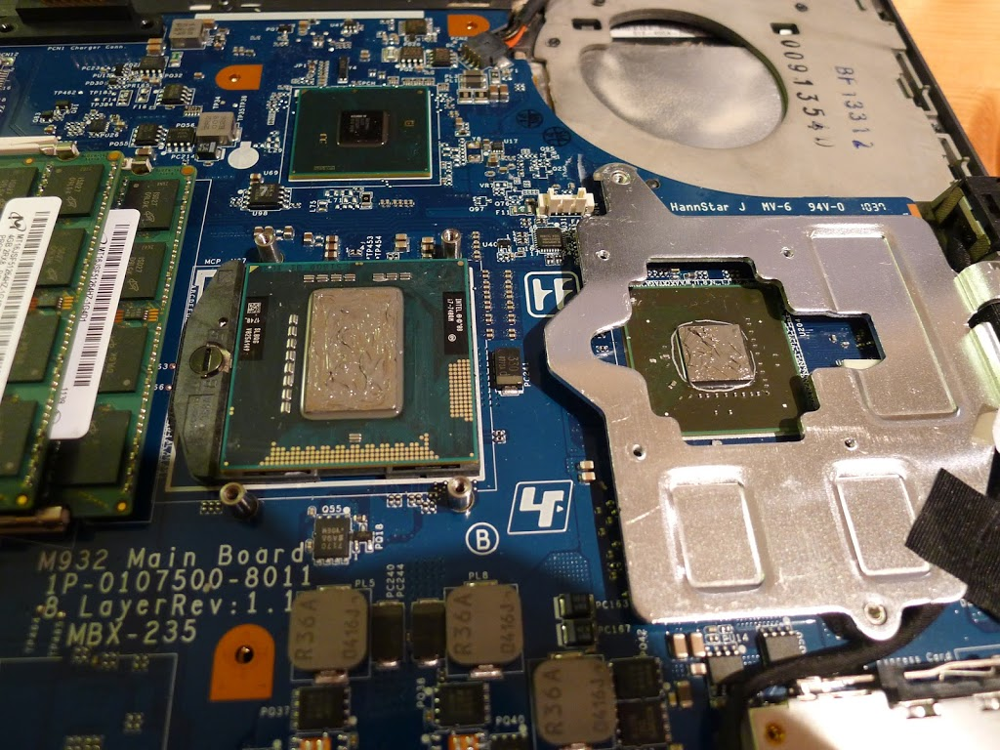
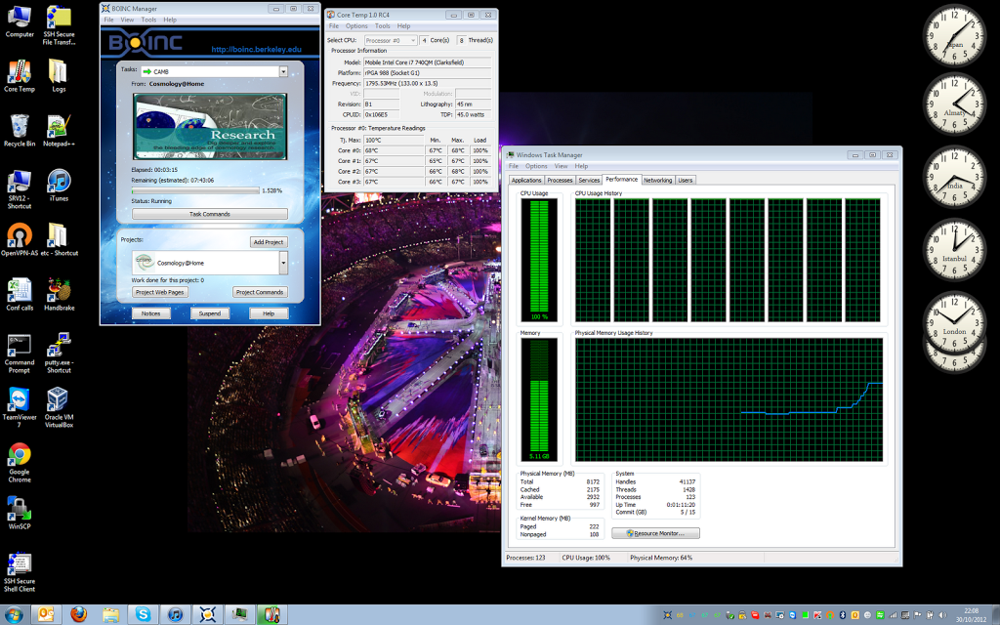

My work laptop (a Sony Vaio VPCF13M0E) had become very noisy, with the fan running full speed as soon as it did any actual work.  A bit of googling found that this was a common problem.  The original heatsink paste becomes dried up, and doesn't conduct heat well.

Here's some pictures of the steps I took to fix it.  Obviously ONLY ATTEMPT THIS if you know what you're doing, and the machine is out of warranty.

Time taken: 2 to 3 hours total.
You will need:

*   Small cross-head screwdriver
*   Anti-static wrist strap
*   Heatsink paste
*   Methylated spirits
*   Cotton buds, kitchen roll
*   Somewhere safe to put all those tiny screws - I recommend a large blank sheet of paper (with a drawing of the back of the machine) to put the screws down onto

1.  Remove the battery, and all the screws on the back plate.  Keep careful note (with a drawing of the back of the machine) where all the screws go.  There are several different kinds, and a few little tricks.

    Remove the screws - on the back
    * inside the battery compartment
    * near the battery connector
    * covering the RAM (middle plate)
    * covering the hard disk (lower left)
    * holding the hard disk in.

    The optical disk drive can be pulled out of the machine, revealing three small screws (on the left). I counted 24 screws in total.

    Next is the tricky bit.  The plastic back plate can be gently lifted off, taking care to not stress the USB, SATA, ethernet and VGA sockets on the right of this picture.  Nearly there!

    

1.  Wear an anti-static wrist-strap for this next stage.  You can see mine is clipped onto the metal part lower-right.

    The CPU and GPU heatpipe plates are held on by springy metal strips and four screws each.  Take these off and keep them separately.  Remove the small fan connector from the motherboard.

    Once it's free to move, ease the plates away very gently from the top of the CPU and GPU chips.  Some dried paste will be left behind on each one.

    

1.  Clean all the old grey gunk off the plates with cotton buds and methylated spirit.  Very carefully clean around the CPU and GPU chips with cotton buds/meths, making sure not to damage any of the small surface-mount components.

1.  Examine the state of the heatpipe.  There should be no leaks or other damage.

    I found that the copper heat plates that go onto the CPU and GPU, were not very flat!  You can see the ridge marks where it has a concave bit.

    A bit of work with a diamond file got them to be much flatter (this picture was taken about half way through the flatting work). Only do this if you are confident and skilful with this kind of work; you should still get OK but not ideal results if you just clean (but don't flatten) the heat plate.

    

    Take care not to remove too much material!  Keep cleaning both the file and the work with methylated spirit to avoid build-up of copper particles that could leave deep scratches.

1. Finally you should have everything clean and ready to put back together.

    Apply a thin coat of good quality heatsink compound (I used Arctic Silver).  The amount I've put on here is plenty - any more will just get squeezed out and be wasted.

    

1.  I gave the heat plate springs a gentle tweak to make sure they were pushing the plates down. I also gently cleaned the fan blades with a paint brush and hoover to remove dust.  There wasn't much dust build-up on the actual heat sink blades.

1.  Re-fit the heatpipe carefully.  It's best to work slowly and fit screws in diagonal opposites i.e.
    ```
    1  4
    3  2
    ```

1. Fit the back of the laptop back on, and re-fit all the parts and screws.


1.  Finally - proof that it's definitely worked is that your laptop should run quieter and better.  If you want to give it a good workout, I would recommend downloading and running some Cosmology@home tasks.

You can see with all CPUs running at 100%, the cores are at a max. of 68C which is fine.

 
