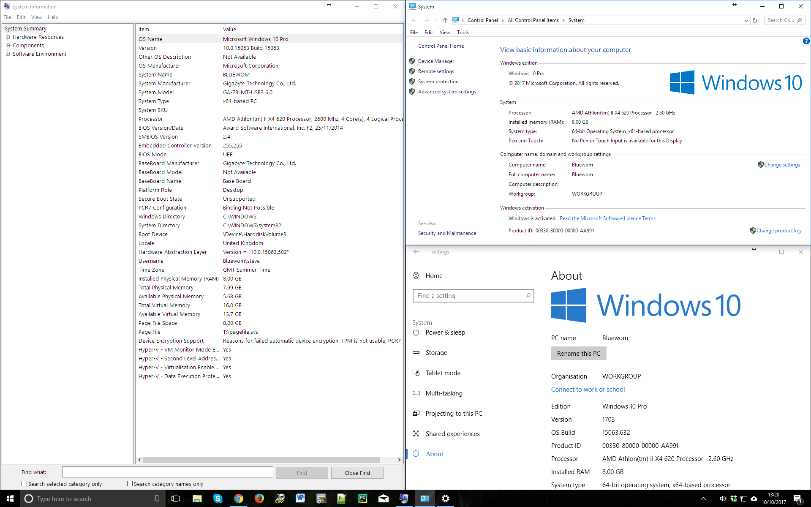

If you go to the search bar in Windows 10, and type "settings" - there are now at least three different places you might end up:

The one on the left is "System Information".  It's been around a while. You'll notice it reports "version" as 10.0.15063.

Top right, you get to from the classic Windows control panel / System. It shows we are version 10, but gives no other information.

You see the "Advanced system settings" on the left there?  Nope, that's something else entirely.  It will display a window called "System Properties" instead. That will tell you some things, but not the version you're running.

Lower right is the new kid on the block, with its fancy Metro style. This you get to via Windows Settings, which proudly displays it's a "Trusted Windows Store App".  Did I have to buy it? I don't think so. It announces using a different format. It says the Version is 1703.  The OS Build is 15063.632. If you widen that window, more options appear. One of them is called "System Info". This doesn't take you to System Information, oh no. It takes you back to the Control Panel / System. 

Hooray! Pretty confusing, huh? How does anyone ever ask a user which version they are actually running?