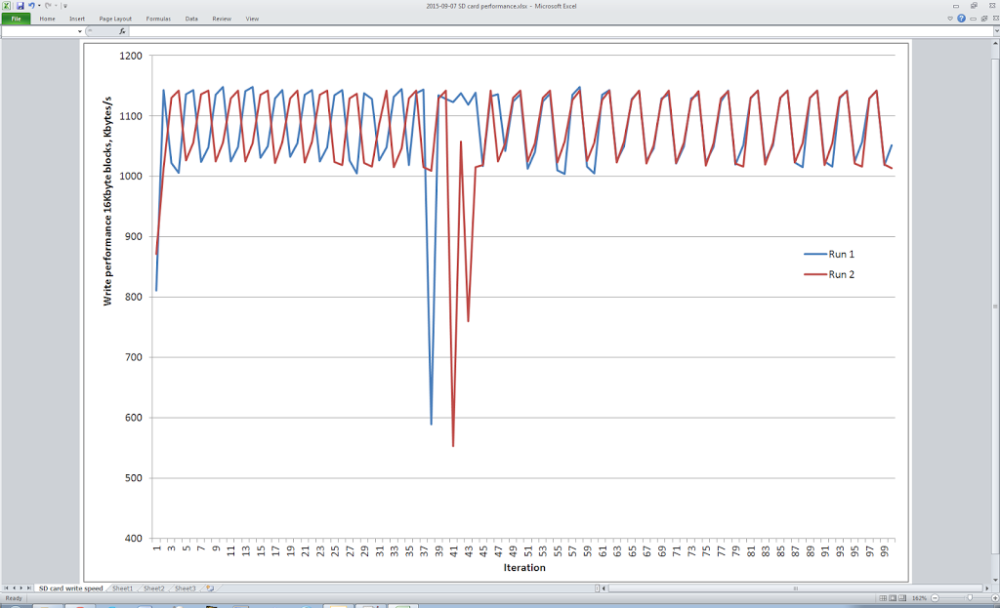

Here's a graph showing the write performance to a Sandisk Class 10 memory card.

The reason for the sharp dips in performance, are that the FAT filing system has to go off and allocate a new cluster every N writes.  For example 512 byte sectors, 32Kbyte clusters, means a new cluster is needed every 64 writes.

Another factor on the XMOS board is whether the code is running in 'debug' or 'release' mode. This can make around 2x difference.

I also found that the code published on https://github.com/xcore/sc_sdcard seems to not pay attention to setup and hold times, and appears to be leaving the clock line in a logic "1" state when in fact data gets clocked on a logic 0 -> 1 transition.

All this led me to branch the repo and produce my own version, here: https://github.com/tuck1s/sc_sdcard

The changes are too numerous to list here (see the github changelog) but with pre-allocation of a file with contiguous sectors, and a Sandisk Extreme Pro SDcard, there's enough performance to write around 3Mbytes/s to the card.

My experiments with the even smaller "PetitFAT" filing system were halted because it only reads/writes a sector at a time and that would not give enough performance.

Measuring 'where the time goes', I can see that the time taken to clock in a sector's worth is usually only a few hundred microseconds, whereas the card can then take several milliseconds to respond that it's done. This is highly variable and also highly dependent on the grade of the SD card.